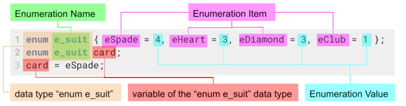

# 8. Creating and Using Enumerations

Enumeration or Enum in C is a special kind of data type defined by the user. It consists of constant integers that are given names by a user. The use of enum in C to name the integer values makes the entire program easy to learn, understand, and maintain by the same or even different programmer.

- allow us to group conceptually related values together in an set (_to make the relationship between each value clear_)
- helps to write more readable code, by grouping related values together, which can be used by an meaningful name
- the value itself is not always impotent, it is the "enum item names" which can be used as a "super boolean"

---

## Creating Enumerations

### 1. Defining Enumerations

- enumerations values are always of type `const int` (_the value itself can not change_)



- **line 1:** defines the `enum e_suit` data type, the name is arbitrary
  - **CONVENTION:** enum names should be named lowercase and starting with `e_` followed by the name
  - **NOTE:** "enumeration item names" need to be uniq, but there values can be the same
- **line 2:** declare a variable of the data type `enum e_suit` with the name `card`
- **line 3:** assign a value `4` to the variable `card`

#### 1.1 Without Defining Values

Let the compiler assign values.

```c title="let the compiler assign values"
 enum e_suit { eSpade, eHeart, eDiamond, eClub };
 // the values are up to the compiler, usually they are sequenced from: 0, 1, 2, 3
```

```c title="can be assigned by compiler and programmer"
 enum e_suit { eSpade = 0, eHeart, eDiamond, eClub = 2};
 // the undefined values are up to the compiler, does not consider set values: 0, 1, 2, 2
```

##### examples of "enum data type variable" usage

```c title="possible values for a variable of the data type enum ..."
enum e_suit card;   // declaring a variable 'card'
card = eHart;       // value is 3
card = 8;           // value is 8, 'eHart' is a const but the variable itself can change
card = 4.3;         // value is 4, because of conversion to int
card = card - 3;    // value is 1, can be used like any other number in operations
card = "string";    // NOT POSSIBLE! can be only int
if (card == eClub)  // can be used in comparison
if (card == 1)      // the same as above
```

### 2. Scoping the Enum Data Type

```c title="global (anywhere accessible in the whole file, but not in other files)"
enum e_something { someA = 1, someB = 2, someC = 5 };

int	main(void){
    enum e_something hello;}
```

```c title="local (only within the block and its sub blocks )"
int	main(void){
    enum e_something { someA = 1, someB = 2, someC = 5 };
    enum e_something hello;
    if (true)
        // "hello" is accessible
}
void some_function(void){
        // "hello" is not accessible
}
```

### 3. Anonymous Enum Data Type (literal integer constants)

We can declare an anonymous enumerated type that contains enumerated items that act identically to literal constants, as follows:

```c title="without name"
#include <stdio.h>                                // needed for printf
enum { inchesPerFoot = 12, array_size = inchesPerFoot * sizeof(int) };

int main(void) {
  printf("inches per foot: %d\n", inchesPerFoot); // constant name is replaced with value: "12"
  printf("array_size: %d", array_size);}          // value is calculated at compile time: "48" (if int 4byte)
```

- is very useful when naming the size of an "non-variable-length-array" `int    some_array[array_size];`
- if we would have stored the vale for `array_size` in an variable or in an named enum, then we would have created an "variable-length-array".

---

## Simplifying the use of enum types with typedef

##### 1. define and declare variables without typedef

```c
enum e_face { eOne , eTwo , eThree , ... };         // defining enumeration types
enum e_suit { eSpade , eHeart, ... };
enum e_face f1 , f2;                                // then declare variables of those types.
enum e_suit s1 , s2;
```

```c
enum e_face { eOne , eTwo , eThree , ... } f1, f2;  // same as above, just shorter
enum e_suit { eSpade , eHeart, ... } s1, s2;
```

##### 2.1. defining with typedef

Creating a synonym `t_face` for the `enum e_face` data type

```c
enum e_face { eOne , eTwo , eThree , ... };         // defining enumeration types
enum e_suit { eSpade , eHeart, ... };
typedef enum e_face t_face;                         // creating a synonym for the data type enum e_face
typedef enum e_suit t_anyname, t_anyname_2;         // the synonym can be any name, can be more then one name
```

```c
typedef enum e_face { eOne , eTwo , eThree , ... } t_face;;      // same as above, just shorter
typedef enum e_suit { eSpade , eHeart, ... } t_anyname, t_anyname_2; // can be more then one name
```

##### 2.2. declaring variables using typedef data type

```c
t_face f1, f2;
t_anyname_2 s1, s2;
```
