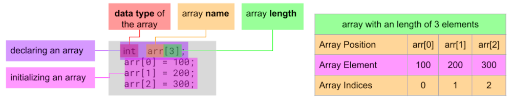

# 11 Working with Arrays

- An array is a collection of two or more values, all of which have the same type and share a single common base name.
- Once an array is declared, its size is fixed and cannot be changed.

---

## Creating an Array

There are two types of arrays: **constant-length** and **variable-length VLA** arrays



### Declaring an Array

- **data type:**
  - any intrinsic data types: whole numbers (_integers_), real numbers (_floating point and complex numbers_), characters, Boolean
  - user-defined data types: enumeration and structures
  - complex data types: arrays, pointers
- **name:**
  - name of the array
- **length:**
  - the length determents how many elements an array can have, it can not be changed after
  - must be a positive integer

### Initializing an Accsessing an Array

- is done by accessing the index position of an element and assigning an value to it
- **NOTE:** indexing starts from 0, a array with 4 elements has an index from 0 to 3
- any expression (function returns, variables, calculations) can be used to accesses an array element, as long it is an integer

```c
int arr[4];             // declaring an array with 4 elements
int index;
index = 1;
arr[0] = 100;           // initializing a value to the 1st index position
arr[index] = 200;       // using a variable to assign a value to the 2nd index position
arr[index +1] = 300;    // using an expression to get to the 3th index position
arr[fun()] = arr[2];    // evaluating a function "int fun(void) { return (3); }" to get to the 3rd index, assign the value from the 2nd index
```

#### declaring and initializing

All of this examples are constant-length arrays:

```c
float lengthArray[] = {1.0 , 2.0 , 3.0}; // dynamic assignment: the length is determent by its values in this example 3
int anArray[10] = {8};                   // the length is 10 elements and every element is set to '8'
```

---

## Constant-Length Arrays

- Is an array who's size or length is known at compile time and before runtime.

```c
int anArray[10];                // literal constant value

#define ARRAY_SIZE 10
int secondArray[ ARRAY_SIZE ];  // a preprocessor symbol is used to define the array size

enum {
  eArraySize = 10
}
int thirdArray[ eArraySize ];   // an enumeration constant is used to define the array size
```

---

## Variable-Length Arrays VLA

- Is an array who's size or length is **not** known until runtime and can only be evaluated when the program is running, at runtime.
- Once created, the size of a VLA is fixed and cannot change.
- Can not be initialized when they are declared.
- Enable functions to operate on arrays much more flexibly (_function parameters_).
- since C11, variable length arrays are optional, not all compiler support them.

```c showLineNumbers
const int kArraySize = 10;
int fourthArray[ kArraySize ];                      // constant is used
int arraySize = 10;
int fifthArray[ arraySize ];                        // variable is used
int someVariable = 5;
int sixthArray[ 2 * someVariable ];                 // a variable is involved
double tireTread[ getNumberOfWheels( tricycle ) ];  // return of an function
int n;
scanf("%d", &n);
int array[n];                                       // user input
```

- **line 2, 4:** The C compiler does not see any difference between a variable and constant variables when they have been declared.

:::info

In C99, VLAs were a mandatory feature of the language. However, VLAs could not be reliably implemented due to memory constraints in certain environments. This, therefore, limited the adoption of C99. To remedy this, C11 made VLAs an optional feature of the language. Any implementation that does not support VLAs sets the `STDC_NO_VLA` symbol to 1. This can then be tested by the programmer at runtime and handled appropriately, as follows:

```c
#if __STDC_NO_VLA__

  … Code that does not use VLAs.

#else

  … Code that uses VLAs.

#endif
```

:::

---

## Working with Arrays

### calculating the length of an array

Can also be used to index the last element of an array or to start a loop from the last element.

```c
int arr[4] = {0};
unsigned long arr_length;                           // needs to be "ul" for sizeof()
int           last_element;
arr[3] = 99;
arr_length = sizeof(arr) / sizeof(int);             // length of array as "unsigned long"
last_element = arr[sizeof(arr) / sizeof(int) - 1];  // accessing the last element, 99
```

### out-of-bounds errors

Accessing an element which is out of the bound of the array leads to errors.

```c showLineNumbers
int main( void )  {
  int   anArray[10]  = {0}; // Initialize the whole thing to 0.
  int   x;
  x = 11;
// highlight-next-line
  anArray[ 11 ] = 7;        // Compiler error!
// highlight-next-line
  anArray[ x ]  = 0;        // No compiler error, but runtime error!;
  return 0;
}
```

### operating on arrays with loops

```c title="for loop"
const int kArraySize = 25;
int anArray[ kArraySize ];
for( int i=0 ; i < kArraySize ; i++ )  {   // i: 0..24 (kArraySize-1)
  anArray[ i ] = i;
}
```

```c title="while loop forward"
int kArraySize = 25;
int index = 0;
int anArray[ kArraySize ];
while (index < kArraySize) {          // range should be 0-24
  anArray[index] = index;
  index++;
}
```

```c title="while loop backwards"
int kArraySize = 25;
int anArray[ kArraySize ];
while (kArraySize--) {                // subtract one after expression is evaluated, 24-0
  anArray[kArraySize] = kArraySize;
}
```

### Using functions that operate on arrays

An array is a collection of variables bound together by a common base name and an offset from that base. In nearly every respect, we can treat an individual element of an array just as we would any other variable. Even with function parameters, array elements can be passed into them as with regular variables, as follows:

###### passing an array element (value)

```c
#include <math.h>
int anArray[10] = {0};
anArray[3] = 5;                     // 4th value is assigned a value of 5
anArray[3] = pow( anArray[3] , 2 ); // a value of 5 is passed into the function
```

##### prototype of functions which operate on arrays

```c
int five_elements( int size, int anArray[5] );  // the array needs to have 5 elements
int find_min( int size, int anArray[] );        // the array can have any number of elements
double find_mean(   int size , int anArray[*] ); // the array needs to be a VAL, length known at runtime
```

- C dose not copy the entire array into the function, just a reference of it
- the array name is a named reference to a memory location and the named reference is being copied into the function

##### example of an function operating on an array

```c
int find_min( int size , int a[] )  {
  int min = a[0];
  for( int i = 1 ; i < size ; i++ )
    if( a[i] < min )   min = a[i];
  return min;
}

double find_mean( int size , int a[] )  {
  double sum  = 0.0;
  for( int i = 0 ; i < size ; i++ )  {
    sum += a[i];
  }
  double mean = sum / size;
  return mean;
}
```

- notice that the VLA indication is [] and not [*]
- notice that variables are declared as they are needed and are not necessarily all declared at the beginning of the function block
