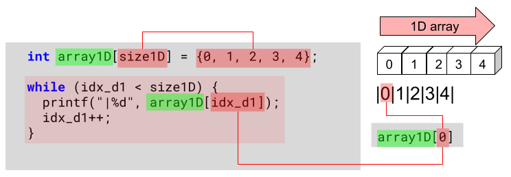

# 12 Working with Multi-Dimensional Arrays

- you can find the source code on my [Replit](https://replit.com/@ZoltsKe/cmultidimensionalarrays?v=1) site
- the code snippets of the different dimensional arrays continue form this code ...

```c
#include <stdio.h>
#include <string.h>

enum { size1D = 5, size2D = 4, size3D = 3, size4D = 2 };  // literal integer constants
int main(void) {

  int idx_d1 = 0;
  int idx_d2 = 0;
  int idx_d3 = 0;
  int idx_d4 = 0;
// .... see code snippets below ...
```

---

## 1 Dimensional Array



---

## 2 Dimensional Array


---

## 3 Dimensional Array


---

## 4 Dimensional Array


