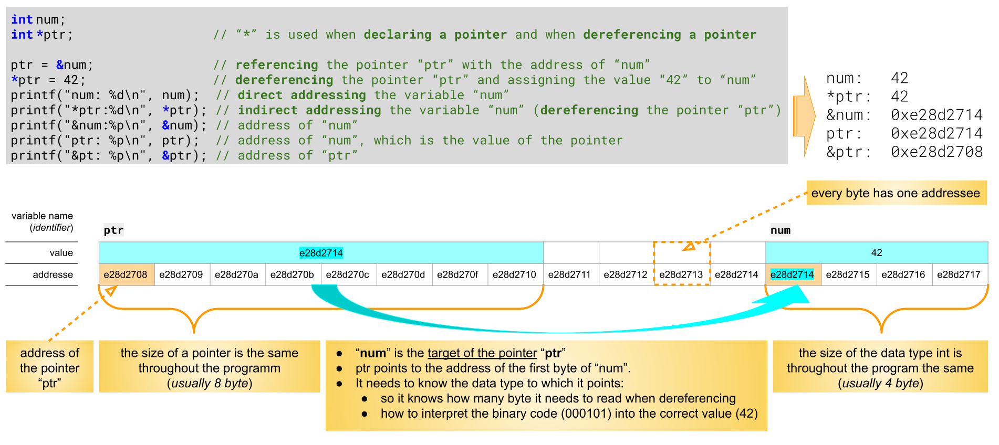
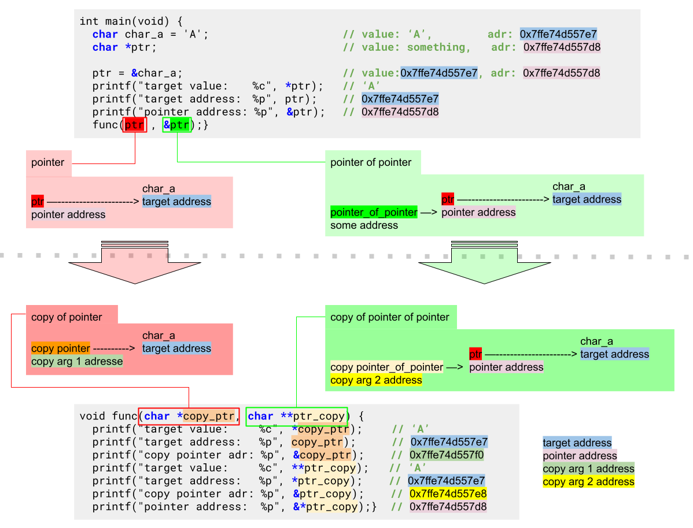

# 13 Using Pointers

##### Why use pointers

- To **overcome the call-by-value** restriction in function parameters: Pointers expand the flexibility of function calls by allowing variable function parameters.
- As an **alternative to array subscripting**: Pointers allow access to array elements without subscripting.
- To **manage C strings**: Pointers allow easy (ahem, easier) allocation and manipulation of C strings.
- For **dynamic data structures**: Pointers allow memory to be allocated at runtime for useful dynamic structures, such as linked lists, trees, and dynamically sized arrays.

:::note Managing and accessing memory

C provides ways for a program to allocate, release, and access virtual memory in our physical address space; it is then up to the OS to manage the physical memory. The OS swaps virtual memory in and out of the physical memory as needed. In this way, our program is only concerned with the virtual memory address space.
Every time we run our program, the memory addresses within it will likely change. This is why we are concerned with named locations and never specific memory addresses.

- Memory is seen as one large contiguous block.
- Everything in a computer is stored somewhere in memory or is accessible via a memory location.
- Every byte in a computer's memory has an address.
- Variables (_named locations_) are fixed addresses in memory, the address points to the first byte and the data type defines how many byte belong to the variable (_and how to interpret the binary code_).

:::

---

## Creating Pointers

:::info pointer

A pointer is a variable which stores the address of another variable.

:::


### step 1: declaring a pointer type and identifier

A pointer is a variable. Therefore, it has a type and an identifying name. It is distinguished as a pointer at declaration with the `*` notation.

```c
// highlight-next-line
int     *p_num;     // type: int*   // * operator before name, 42 convention
char*   p_str;      // type: char*  // * operator after data-type
float * p_float;    // type: float* // space between * operator
```

- needs to have the same **data type** as the variable to which it will point to
  - valid types are: intrinsic (whole numbers (**integers**), real numbers (**floating point** and **complex numbers**), **characters**) or any already-defined custom type (such as an **array**, **struct**, and **typedef**)
- the `*` **dereferencing operator** needs to be used together with the **data-type** when a pointer is declared

### step 2: referencing (assigning) pointer values (addresses)

:::info referencing a target
A variable becomes the **target** of an pointer by assigning it's address to the pointer.
:::

```c
int  height;
int* pDimension;        // 1. declare a pointer of type int
// highlight-next-line
pDimension = &height;   // 2. assign the address of the variable "heights", both point now to the same memory address
```

- use the `&` **address operator** to get the address of a variable and assign `=` it to the pointer variable
- new values (addresses) can be assigned to the pointer at any time

#### initialize a pointer with NULL

There are times when a proper address cannot be assigned or the desired address is currently unknown. For these instances, there is a constant `NULL pointer`. This value is defined in `stddef.h` and represents a value of `0`.

```c
#include <stddef.h>        // option 1: use the header in which the Null constant is defined or
#define NULL ((void*)0);   // option 2: define the constant yourself

int     *p_num = NULL;     // declare and initialize a pointer to  NULL
```

In this way, we can test for NULL and know that the pointer variable is not in use.
If we don't initialize a pointer variable to null, it may have a random value that we cannot differentiate from a valid memory address.

### Dereferencing (accessing) pointer targets

:::info dereference a pointer
To access the value to which a pointer points (_it's target_) we need to use the `*` **dereference operator**.
:::

```c
int     num;
int     *ptr;

ptr = &num;                 // referencing: passing the address of num to ptr, num is now the target
*ptr = 42;                  // dereferencing: assigning the value 42 to the target
printf("num: %d", *ptr);    // dereferencing: retrieving the value of the target which is 42
printf("num: %d", num);     //                retrieving the value of     num    which is 42
```

A **dereferenced pointer** gives you the **same** possibility's **as the value of the variable** to which the pointer is pointing.

- **direct addressing:** is when the value of an variable is directly read
- **indirect addressing:** is when the value of an variable is read over a pointer

---

## Understanding the void\* type

There are times when the type of a pointer is not known. This occurs primarily in C library functions.

For this reason, the void* pointer type represents a generic, as yet unspecified pointer – in other words, a pointer whose type is not known at declaration. Any pointer type can be assigned to a pointer variable of the void* type. However, before that pointer variable can be accessed, the type of the data being accessed must be specified through the use of a casting operation:

```c
int height = 10;
void* aPtr = NULL;          // we don't yet know what it points to.
aPtr = &height;             // it has the address of height, but no type yet.
int h = *(int*)aPtr;        // with casting, we can now go to that address and fetch an integer value.
```

Casting tells the compiler exactly how many bytes to fetch and exactly how to interpret those bytes. Once aPtr is cast to a type, it can be dereferenced.

---

## Comparing pointers

Hire we are checking the address and not the value at the address.
In each case, we can either check for equality `==` or inequality `!=`. Because we can never be certain of the variable ordering in memory, it makes no sense to test whether one pointer is greater than `>` or less than `<` another pointer.

### most common comparisons:

- Is a pointer equal or not equal to NULL?
- Is a pointer equal to or not equal to a named location?
- Is one pointer equal or not equal to another pointer?

##### comparisons of a pointer to NULL

```c
// ... some code which declares the pointer "pDimension" ...
// both statements do the same, TRUE if NULL
if( pDimension == NULL ) printf("pDimension points to nothing!\n");
if( !pDimension ) printf( "pDimension points to nothing!\n" );
// both statements do the same, TRUE if NOT NULL
if( pDimension != NULL ) printf("pDimension points to something!\n");
if( pDimension ) printf( "pDimension points to something!\n" );
```

**NOTE:** a pointer still points to some address if it was not initialized!

##### comparisons of a pointer to a named location

```c
// ... some code which declares the pointer "pDimension" and the variable "height"...
if( pDimension == &height )
  printf( "pDimension points to height.\n" );
if( pDimension != &height )
  printf( "pDimension does not point to height!\n" );
```

##### comparisons of a pointer to another pointer

```c
int* pDim1 = NULL;
int* pDim2 = &height;
pDim1 = pDim2;         // without this line both pointer would point to a different address
if( pDim1 == pDim2 ) printf( "pDim1 points to the same location as pDim2.\n" );
if( pDim1 != pDim2 ) printf( "pDim1 and pDim2 are different locations.\n" );
```

---

## Variable function arguments

:::info call by value
Function parameters in C are "**call by value**". When a function is defined to take parameters, the values that the function body receives through them are copies of the values given at the function call. Once the function ends, all copies are deleted.
:::

### Passing values by value

:::info Passing by value
Values are passed to a function and not there addresses.
:::

```c
double RectPerimeter( double h , double w )  {
  h += 10.0;
  w += 10.0;
  return 2*(w + h) ;
}
int main( void )  {
  double height = 15.0;         // value dose not change after function call
  double width  = 22.5;         // value dose not change after function call
  double perimeter = RectPerimeter( height , width );   // return calculation
}
```

- One advantage of call by value is that we can modify the copies of values passed into the function and the original values remain unchanged.
- One disadvantage of call by value is that for parameters that are very large arrays or structures, this copying is significantly inefficient and may even cause the program to crash.

```c
typedef struct _RectDimensions  {
    double height;
    double width;
    double perimeter;
} RectDimensions;
RectDimensions RectPerimeter( RectDimensions rd )  {
  rd.height += 10.0;
   rd.width += 10.0;
   rd.perimeter = 2*(rd.height + rd.width);
   return rd ;
}
int main( void )  {
   RectDimensions rd;
   rd.height = 15.0;        // value dose change after function call
   rd.width = 22.5;         // value dose change after function call
  rd = RectPerimeter( rd ); // overwrite values of the original structure
}
```

The function changes the values of the structure because, a copy from the function is returned which is assigned to the original structure.
It works, but it is inefficient.

### Passing values by reference

If we wanted to change the values of parameters so that they are also changed after the function returns, we can use pointers to do so. We will assign the address of the values that we want to modify to pointer variables and then pass the pointer variables into the function.

:::info passing by reference
Every **address** which is passed to a function (through a pointer) gets also copied, but because they can be dereferenced, the value at the memory address can be manipulated and will persist after the function ends.  
To manipulate the pointers address, we need to pass it as a pointer of a pointer.
:::

:::danger side effects
Any function that modifies values that exist outside of its function body is said to have **side effects**. In many cases, side effects may cause unanticipated consequences and so should be employed with careful intention and caution.
:::



#### Passing addresses to functions with pointer variables

```c
double RectPerimeter( double *pH , double *pW )  {
   *pH += 10.0;                     // dereference address, makes changes value at memory address
   *pW += 10.0;                     // dereference address, makes changes value at memory address
   return 2 * ( *pW + *pH ) ;
}
int main( void )  {
   double  height = 15.0;
   double  width  = 22.5;
   // highlight-next-line
   double *pHeight = &height;       // value does change after function call
   // highlight-next-line
   double *pWidth  = &width;        // value does change after function call
   // highlight-next-line
   double  perimeter = RectPerimeter( pHeight , pWidth );
}
```

#### Passing addresses to functions without pointer variables

```c
double RectPerimeter( double *pH , double *pW )  {
   *pH += 10.0;                     // dereference address, makes changes value at memory address
   *pW += 10.0;                     // dereference address, makes changes value at memory address
   return 2 * ( *pW + *pH ) ;
}
int main( void )  {
   double  height = 15.0;           // value does change after function call
   double  width  = 22.5;           // value does change after function call
   // highlight-next-line
   double  perimeter = RectPerimeter( &height , &width );
}
```

---

## Using pointers to structures

A structure is a named location that holds a collection of named values. The structure as a whole is named, as are each of the member elements of that structure.

Once the structure type is defined, variables may be declared that are of that type. When a variable of any type is declared, the appropriate number of bytes is allocated in memory to store the values of that type. We can then access the member's structure elements directly via the structure variable's name and the . notation.

Declaring a pointer to a structure variable is no different than declaring a pointer to any other variable. The variable must already have been declared (that is, allocated). The pointer address is the first byte allocated to the structure, just as for any other variable.

### creating a structure and targeting it with an pointer

##### step 1: defining a structure:

```c
typedef struct {
   int day;
   int month;
   int year;
} s_date;
```

##### step 2: declaring a variable of that structure type:

```c
s_date anniversary;
```

##### step 3: assign values to the structure variable:

```c
anniversary.month = 8;
anniversary.day   = 18;
anniversary.year  = 1990;
```

##### step 4: declare a pointer to the structure variable:

```c
s_date* pAnniversary = &anniversary;
```

### Accessing structures and their elements via pointers

We access the structure as a whole as we did with intrinsic variables so that `*pAnniversary` and `anniversary` refer to the same memory location.

To access one of the anniversary elements via the pointer, we might consider using `*pAnniversary.month`. However, because the `.` operator has higher precedence than the `*` operator, the element reference will fail evaluation and will be inaccessible. We can change the evaluation order with parentheses, as follows:

```c
(*pAnniversary).day     // is the same as: "anniversary.day"
(*pAnniversary).month   // is the same as: "anniversary.month"
(*pAnniversary).year    // is the same as: "anniversary.year"
```

Because accessing structure elements via pointers is quite common, an alternative syntax to access structure elements via pointers is available. This is done using the `->` operator and appears as follows:

```c
pAnniversary->day     // is the same as: "(*pAnniversary).day"
pAnniversary->month   // is the same as: "(*pAnniversary).month"
pAnniversary->year    // is the same as: "(*pAnniversary).year"
```

### Using pointers to structures in functions

Now that we can use an indirect reference (a pointer) to a structure variable as easily as we can with a direct reference (a variable identifier) to a structure variable, we can use the indirect reference in function parameters to avoid the unnecessary copying of structures to temporary function variables. We can use the structure pointer in function parameters, as follows:

```c
void printDate( s_date* pDate );
```

We declare the pointer to the structure type in the function declaration. We then define the function, accessing each element, as follows:

```c
void printDate( s_date* pDate )  {
   int m, d , y;
   m = pDate->month;
   d = pDate->day;
   y = pDate->year;
   printf( "%4d-%2d-%2d\n" , y , m , d ); // or
   printf( %4d-%2d-%2d\n" ,pDate->year ,pDate->month , pDate->day );
}
```

In the definition of printDate(), we can create local variables and assign the dereferenced pointer values to them, or we can just use the dereferenced pointer values without creating and assigning temporary variables.

We will then call printDate(), as follows:

```c
s_date anniversary = { 18 , 8 , 1990 };
s_date* pAnniversary = &anniversary;
printDate( pAnniversary );
// or
printDate( &anniversary );
```
