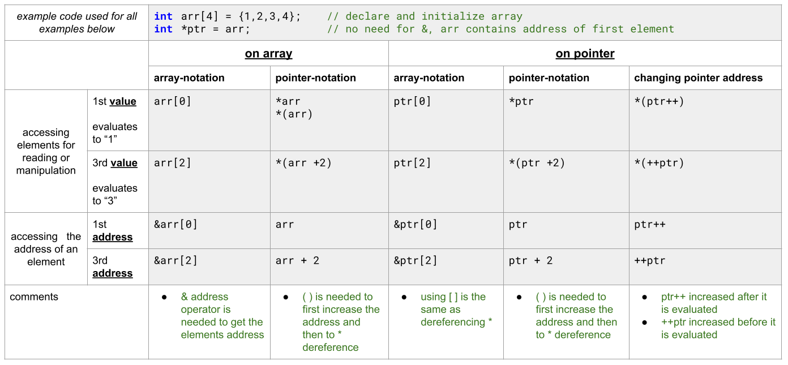

# 14 Understanding Arrays and Pointers

C pointers and arrays are closely related; so closely, in fact, that they are often interchangeable! However, this does not mean pointers and arrays are identical.

:::info
Arrays and pointers are synonymous in terms of how they use to access memory. But, the important difference between them is that, a pointer variable can take different addresses as value whereas, in case of array it is fixed. In C , name of the array always points to the first element of an array.
:::

## Understanding array names and pointers

### array and pointer notation

The table below shows how the same result is achieved with different notations on an array and an pointer.

### pointer arithmetic

An integer value in pointer arithmetic represents the element to which the pointer points. When an integer is added to a pointer, the integer is automatically converted into the size of the pointer element in bytes and added to the pointer. This is equivalent to incrementing an array index.
Even though pointers are nearly identical to integers—they are positive, whole numbers that can be added, subtracted, and compared—they are treated slightly differently from integers when pointer arithmetic is performed.

| arithmetic                  | explanation                                                                                                                                |
| --------------------------- | ------------------------------------------------------------------------------------------------------------------------------------------ |
| pointer + integer → pointer | go to next address                                                                                                                         |
| integer + pointer → pointer | go to next address                                                                                                                         |
| pointer – integer → pointer | go to previous address                                                                                                                     |
| pointer – pointer → integer | difference between pointers, e.g. if data type is int and the pointers are one address away from each other then the result is 1 and not 4 |
