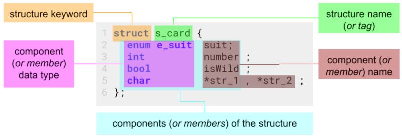

# 9 Creating and using Structures

A structure is a user-defined type. There may be multiple values in a structure and they may be of the same type or different types. A structure, then, is a collection of information representing a complex object.

---

## Creating Structures

There are 3 steps needed to create a structure.

| step                                                                 | description                                                                |
| -------------------------------------------------------------------- | -------------------------------------------------------------------------- |
| 1. [define](#step_1:-defining-a-structure)                           | defines the data type of the structure and its components                  |
| 2. [declare](#step-2-declaring-a-structure)                          | a variable of the data type "structure" is created and memory is allocated |
| 3. [initialize](#step-3-initializing-the-components-of-an-structure) | assigning values for the first time to the structure's components          |

### step 1: defining a structure

```c title="defining the data type 'enum e_suit' first for the structure below"
 enum e_suit { eSpade = 1, eHeart = 2, eDiamond = 3, eClub = 4 };
```



- **CONVENTION:**
  - structure names should be in lowercase and start with the prefix `s_`
  - only one component should be defined in one line
- each component can be of any intrinsic data type (_Integer, Real, Boolean, Char, ..._) or any **previously** defined custom type  
  (_enum or a structure within a structure_)
- the structure can not be a component of itself (_but it can contain a pointe to itself_)

```c
struct s_something {
    struct s_something me;    // !NOT VALID! defining a component with itself
    struct s_something *me;   // OK, defining a component with a pointer to itself,
};
```

### step 2: declaring a structure

```c title="only declare after definition"
struct s_card card, other;   // declare the variable card and other
```

```c title="defining and declaring at the same time"
struct s_card {
  enum e_suit suit;
  int         number;
  bool        isWild;
} card, other;              // declare the variable card and other
```

- a variable with the name `card` of the type `struct s_card` is declared and memory is allocated

### step 3: initializing the components of an structure

A Structures can be initialized in 2 ways:

#### 3.1. at the time of declaration

##### initializing all components with 0

```c
struct s_card card = {0};   // Entire structure is zero-d.
```

- initializing a instance of the structure `s_card` with the name `card` and every component with the value `0`
- can only be done when the variable (_`card` in this example_) is declared

##### initializing all components individually

```c
struct s_card card = { eSpade , (int) eHeart , false };
```

- must be in the same order in which the structure was declared

##### assigning a already initialized structure of the same type (layout)

```c
struct s_card card = card_0;
```

- creates an copy of the before initialized structure `card_0`
- a default instance of the structure can be created which serves as blueprint for future instances
- the component type of the two structures and padding must match for the bitwise assignment to work

#### 3.2. after the declaration

##### component by component:

```c
card.suit = eHart;
card.number = 42;
card.isWild = false;
```

- values of an structure can be resigned (_like variables_) at any time later in the program
- the components do not have to be assigned in the same order that they are defined in the structure, but it is a good practice to do so

---

## Using Structures

### accessing structure components (values)

- components (and there values) are accessed through **dot notation**, _syntax:_ `VARIABLE.COMPONENT`

```c
enum e_suit e_card;                             // declaring a variable of enum 'e_card'
e_card = eDiamond;                              // assign a value to the variable 'e_card'
int handValue = card_2.suit + card_2.number;    // assign the sum of card_2.suit and card_2.number to handValue
if (card_2.suit < e_card){ ...}                 // compare value of card_2.suit to enum variable e_card
```

### structure alignment

- a given structure is padded with enough space so that it contains an even multiple of the size of its largest component
  - _e.g.: if the biggest component is an int with 4 byte then the structure size is an multitude of 4, e.g.:_
    - _1x int (4byte), 3x char (1byte) = 8 byte_
    - _1x int (4byte), 5x char (1byte) = 12 byte_
- Padding within a structure can occur at the end or even in between components. Holes may appear between two consecutive components or after the last component.
- Because of the padding that's used to align structures, we cannot compare two structures as whole entities for comparison. If padding is present in a structure, the contents of that padding may be undefined, depending on how it is initialized. Therefore, even if two structures have identical component values, the values in the padding are highly unlikely to be equal.
- If an equality test is required, a function must be written to compare two structures component by component.

### performing operations on structures – functions

- Except for assignment, there are no intrinsic operations for structures. To perform any operation on a single structure or with two structures, a function must be written to perform the desired operation.

```c title="function to compare two structure components"
bool isEqual( struct s_card card_1 , struct s_card card_2 )  {
  if( card_1.suit != card_2.suit ) return false;
  if( card_1.number != card_2.number ) return false;
  return true;
}
```

### structures of structures

- A structure can contain components of any type, even other structures which have been defined before.

```c
struct s_hand {
  struct s_card card;             // the component is a before defined and declared structure
  struct s_card card_1 , card_2;  // is possible but dose not follow convention
  int           number;
}
```

---

## Simplifying the use of struct types with typedef

##### 1. define and declare variables without typedef

First define a structured type, then declare variables of that type

```c
struct s_card { int num; char letter; };
struct s_card c1 , c2 , c3 , c4 , c5;
```

```c
struct s_card { int num; char letter; } c1 , c2 , c3 , c4 , c5; // the same as above, just shorter
```

##### 2.1. defining with typedef

First define a structured type, then change the data type from `struct s_card` to `t_card` and `t_card_2`

```c
struct s_card { int num; char letter; };
typedef struct s_card t_card, t_card_2;
```

```c
typedef struct s_card { int num; char letter; } t_card, t_card_2; // the same as above, just shorter
```

```c
typedef struct { int num; char letter; } t_card, t_card_2;        // the same as above, just more shorter
```

##### 2.2. declaring variables using typedef typedef data type

```c
t_card c1 , c2 , c3 , c4 , c5;
```
