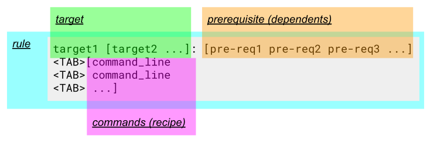
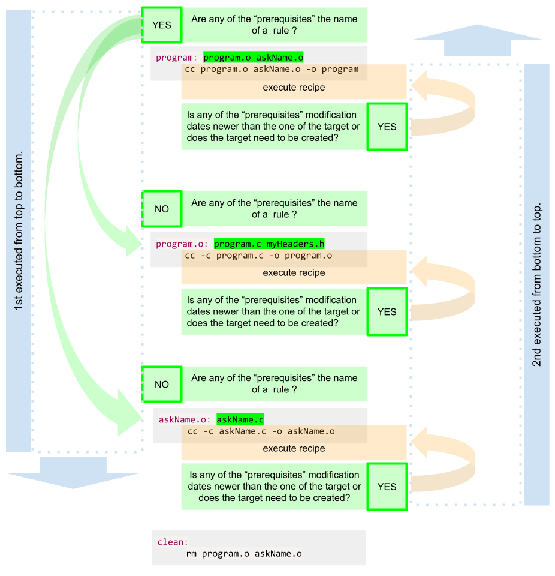

# Managing Projects with GNU make

The make program is intended to automate the mundane aspects of transforming source code into an executable. The advantages of make over scripts is that you can specify the relationships between the elements of your program to make, and it knows through these relationships and timestamps exactly what steps need to be redone (_avoiding unnecessary steps_) to produce the desired program each time.

## Basic Concepts

### How to Write a Simple Makefile

- The specification that "make" uses is generally saved in a file named `makefile` (_or `Makefile`_).

_example of a makefile to compile the `hello.c` source code into a executable `hello` program_ ⬇️

```makefile title="makefile"
hello: hello.c
    gcc hello.c -o hello
```

_to build the program execute "make" by typing `make` into the cli_ ⬇️

```shell title="shell"
$ make
gcc hello.c -o hello
```

- If a target is included as a command-line argument, that target is updated. If no command-line targets are given, then the first target in the file is used, called the **default goal**.

---

### Targets and Prerequisites

- Essentially a makefile contains a set of rules used to build an application.
  

**target:**  
\- is the file or thing that must be made  
**prerequisites** or **dependents**:  
\- are those files that must exist before the target can be successfully created  
**commands** or **recipe:**  
\- are those shell commands that will create the target from the prerequisites

- The **first rule** in an "make" file is the **default rule** and is seen by "make" every time the `make` command is called by itself.
- When "make" is asked to evaluate a **rule**, ...
  1. it begins by finding the files indicated by the **prerequisites** and **target**
     1. If any of the **prerequisites** has an **associated rule**, "make" attempts to update those first.
     2. Next, the **target file** is considered. If the file dose not exist or any of the **prerequisite** is newer than the **target**, the **target** is remade by executing the **commands**. Each **command line** is passed to the **shell** and is executed in its own **subshell**. If any of the **commands** generates an error, the "building" of the **target** is terminated and "make" exits. One file is considered "newer" than another if it has been modified more recently.
- the **rules after the first rule** are only triggered if ...
  - they are part of a dependency of a previous rule and ...
    - the modification date of the prerequisites is newer than of the target
    - if they don't have prerequisite then only the targets which do not exist are created
    - if the rule is not a file (_phony target_)
- if they are called with the `make` command _e.g._ `make rule1 rule2` _would trigger rule1 and rule2 and it's dependencies_



---

### Basic Makefile Syntax

- targets do not have to be actual files, any name will do
- Makefiles are structured top-down so that the most **general target**, often called `all`, is updated by default.
- More and more **detailed targets** follow with targets for program maintenance, such as a `clean` target to delete unwanted temporary files, coming last.

---

## Rules

**Explicit rules:**  
\- Indicate a specific target to be updated if it is out of date with respect to any of its prerequisites.  
**Pattern rules:**  
\- Use wildcards instead of explicit filenames. This allows make to apply the rule any time a target file matching the pattern needs to updated.  
**Implicit rules:**  
\- Are either pattern rules or suffix rules found in the rules database built-in to make. Having a built-in database of rules makes writing makefiles easier since for many common tasks make already knows the file types, suffixes, and programs for updating targets.  
**Static pattern rules:**  
\- Are like regular pattern rules except they apply only to a specific list of target files.  
**Suffix rules:**  
\- Were make’s original means for writing general rules. GNU make includes support for suffix rules, but they are considered obsolete having been replaced by pattern rules that are clearer and more general.

---

### Explicit Rules

- **Explicit rules** specify particular **files** as **targets** and
  **prerequisites**.
- A rule can have more than one target. This means that each target has the same set of prerequisites as the others. If the targets are out of date, the same set
  of actions will be performed to update each one.  
  _For instance:_
  ```makefile
  vpath.o variable.o: make.h config.h getopt.h gettext.h dep.h
  ```
  This indicates that both `vpath.o` and `variable.o` depend on the same set of **C header files**.  
  _This line has the same effect as:_
  ```makefile
  vpath.o: make.h config.h getopt.h gettext.h dep.h
  variable.o: make.h config.h getopt.h gettext.h dep.h
  ```
  The two targets are handled independently. If either object file is out of date with respect to any of its prerequisites (_any header file has a newer modification time than the object file_), make will update the object file by executing the commands associated with the rule.
- A rule does not have to be defined “all at once.” Each time make sees a target file it adds the target and prerequisites to the **dependency graph**. If a target has already been seen and exists in the **graph**, any additional prerequisites are appended to the target file entry in "make’s" **dependency graph**. In the simple case, this is useful for breaking long lines naturally to improve the readability of the makefile:

  ```makefile
  vpath.o: vpath.c make.h config.h getopt.h gettext.h dep.h
  vpath.o: filedef.h hash.h job.h commands.h variable.h vpath.h
  ```

  In more complex cases, the prerequisite list can be composed of files that are managed very differently:

  ```makefile
  # Make sure lexer.c is created before vpath.c is compiled.
  vpath.o: lexer.c
  ...
  # Compile vpath.c with special flags.
  vpath.o: vpath.c
      $(COMPILE.c) $(RULE_FLAGS) $(OUTPUT_OPTION) $<
  ...
  # Include dependencies generated by a program.
  include auto-generated-dependencies.d
  ```

  - The **first rule** says that the `vpath.o` **target** must be updated whenever `lexer.c` is updated (_perhaps because generating lexer.c has other side effects_). The rule also works to ensure that a **prerequisite** is always updated before the **target** is updated. (_Notice the bidirectional nature of rules. In the “forward” direction the rule says that if the lexer.c has been updated, perform the action to update vpath.o. In the “backward” direction, the rule says that if we need to make or use vpath.o ensure that lexer.c is up to date first._) This rule might be placed near the rules for managing `lexer.c` so developers are reminded of this subtle relationship.
  - Later, the compilation rule for `vpath.o` is placed among other compilation rules. The command for this rule uses three **make variables**.
  - Finally, the `.o` / `.h` dependencies are included in the makefile from a separate file managed by an external program.

---

### Wildcards

A makefile often contains long lists of files. To simplify this process make supports wildcards (_also known as globbing_). make’s wildcards are identical to the "Bourne shell’s":
| wildcard | explanation |
|:---: | ---|
| `*` | any character sequence, e.g.: `*.*` expands to all the files containing a period|
| `?` | any single character |
_for example:_

```makefile
prog: *.c           # all files with the extension .c
    $(CC) -o $@ $^
```

:::caution

```makefile
*.o: constants.h
```

The intent is that all object files depend on the header file `constants.h`, but consider how this expands on a clean directory without any object files:

```makefile
: constants.h
```

This is a legal make expression and will not produce an error by itself, but it will also not provide the dependency the user wants. The proper way to implement this rule is to perform a wildcard on the source files (_since they are always present_) and transform that into a list of object files.
:::

- Finally, it is worth noting that **wildcard expansion** is performed by make when the **pattern** appears as a **target** or **prerequisite**. However, when the **pattern** appears in a **command**, the **expansion** is performed by the **subshell**. This can occasionally be important because make will expand the wildcards immediately upon reading the makefile, but the shell will expand the wildcards in commands much later when the command is executed. When a lot of complex file manipulation is being done, the two wildcard expansions can be quite different.

:::caution
In more controlled environments using wildcards to select the files in a program is considered bad practice because a rogue source file might be accidentally linked into a program.
:::

---

## Phony Targets

:::info Remember
Targets that do not represent files are known as **phony targets**.
:::

- phony targets will always be executed (_if triggered_) because the commands associated with the rule do not create the target file which would have a modification date.
- "make" can not distinguish between a **file target** and **phony target**. If by chance the name of a phony target exists as a file, make will associate the
  file with the **phony target name** in its **dependency graph**.  
   _for example:_
  - if the there would be **phony rule** named "clean" and a file also named "clean"
    ```makefile title="makefile"
    clean:
        rm -f *.o lexer.c
    ```
  - than the command `make clean` would led to the following massage:
    `` shell title="shell"
$ make clean
make: `clean' is up to date.
 ``
    _Since most phony targets do not have prerequisites, the clean target would always be
    considered up to date and would never execute._
- To avoid this problem, use `.PHONY`, to tell "make" that a **target** is not a real file. Any target can be declared phony by including it as a **prerequisite** of `.PHONY:`

  ```makefile title="makefile"
  .PHONY: clean

  clean:
      rm -f *.o lexer.c
  ```

  _Now make will always execute the commands associated with clean even if a file
  named clean exists._

- It rarely makes sense to use a phony target as a prerequisite of a real file since the phony is always out of date and will always cause the target file to be remade. However, it is often useful to give phony targets prerequisites. For instance, the `all` target is usually given the list of programs to be built.
- Phony targets can also be thought of as shell scripts embedded in a makefile. Making a phony target a prerequisite of another target will invoke the phony target script before making the actual target.

## Reference

| character | explanation                                                                                                |
| :-------: | ---------------------------------------------------------------------------------------------------------- |
|    `#`    | comment, lasting from the symbol to the end of the line and can be indented                                |
|    `\`    | set at the end of a line allows for the command or list of prerequisites to be continuate on the next line |
