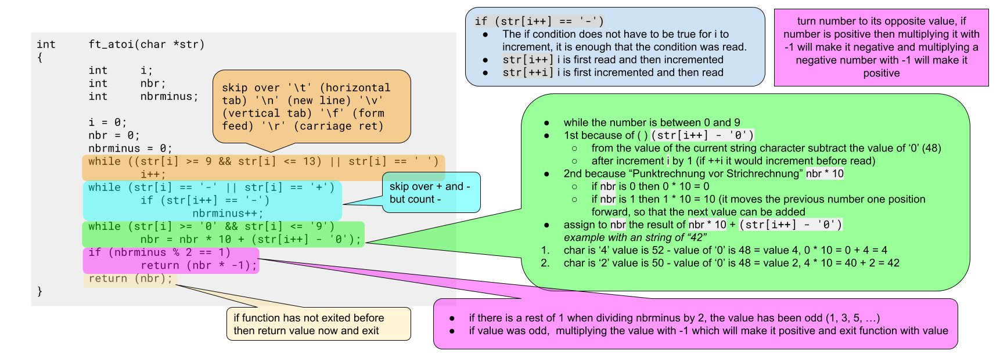

# atoi

Transforms a string into an int. Works like the real "atoi" function (_[see MAN pages](https://man7.org/linux/man-pages/man3/atoi.3p.html)_):

- first character can be **one** **plus** or **minus** but it needs to be followed by a **digit**  
  (`+42` -> `42`, `-42` -> `-42`, `42` -> `42`)
- "**none digits**" succeeding the first digit(s) are ignored  
  (`42xx` -> `42`, `42xx42` -> `42`)
- for any other argument `0` is returned  
  (`+` -> `0`, `xx42` -> `0`)

import Tabs from '@theme/Tabs';
import TabItem from '@theme/TabItem';

<Tabs>
<TabItem value="code" label="Source Code" default>

```c showLineNumbers
int atoi(const char *str)
{
    int nbr;
    int i;

    nbr = 0;
    i = 0;
    if (str[i] == '-' || str[i] == '+')     // skip over one '+', '-'
        i++;
    // highlight-start
    while (str[i] >= '0' && str[i] <= '9')
        nbr = nbr * 10 + (str[i++] - '0');
    // highlight-end
    if (str[0] == '-')                      // positive num to negative
        nbr *= -1;
    return (nbr);
}
```

</TabItem>
<TabItem value="line10-11" label="-> line: 10-11" default>

```c showLineNumbers
    while (str[i] >= '0' && str[i] <= '9')
        nbr = nbr * 10 + (str[i++] - '0');
```

- **line 1:** Only loop if character is a digit.
- **line 2:** add character as single digit to the number
  - `(str[i++] - '0')` _is done 1st because of `( )`_
    - subtract the "ASCII char value" with `'0'`  
      _e.g. (char `'2'` == value `50`) **-** (char `'0'` == value `48`) **=** (char `STX (start of text) ` == value `2`)_
  - `nbr * 10` _is done 2nd because of operations with `*` is solved before `+`_
    - moves the previous digit to the "left" to avoid overwriting it. _e.g. `0 * 10 = 0`, `4 * 10 = 40`_
  - `+` _add both values together, `nbr` is overwrite with the new value_ _e.g. `0 + 4 = 4`, `40 + 2 = 42`_
  - the character (`str[i]`) is "implicit" casted to an int because of the datatype of the variable in which it will be saved

</TabItem>
<TabItem value="42_atoi" label="42 project atoi" default>

The requirement was a bit different for my "42 project", but the principe is the same.


</TabItem>
</Tabs>

<details>
<summary>Code Explanation</summary>

The function `atoi()` takes a parameter `str`, which is a pointer to a "constant character array" (string).

- **line 3-4:** Two integer variables, `nbr` and `i`, are declared to store the converted integer value and to iterate through the characters of the string, respectively.
- **line 6:** `nbr` is initialized to 0, which is returned if there was no "numeric characters" or if "none numeric characters" preceding them (except '+', '-').
- **line 7:** `i` is initialized to 0, representing the index of the first character in the string.
- **line 8:** The if statement checks if the first character of the string is either a '-' or '+'. If it is, the index `i` is incremented by 1 to skip over the sign character.
- **line 10-11:** The while loop is the key part of the code that converts the string to an integer. It iterates through the characters of the string starting from the index `i` and continues as long as the characters are digits (_'0' - '9'_). Inside the loop, the current digit is converted to its corresponding integer value and added to the `nbr` variable. The index `i` is incremented after each iteration.
- **line 12:** If the first character of the string was a '-'. If it was, the `nbr` value is multiplied by -1 to convert the positive number to a negative number.

</details>
