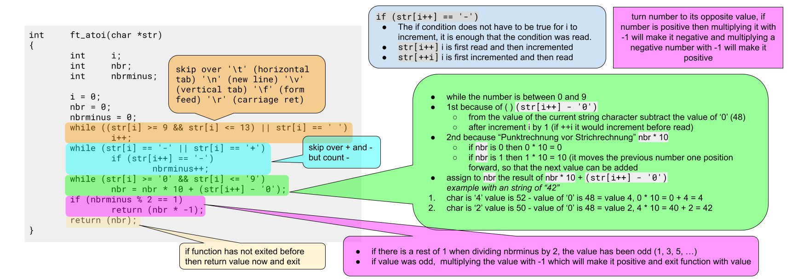

# atoi - ASCII to Int

Transforms a string into an int. Works like the real "atoi" function (_see MAN pages_):

- first character can be **one** **plus** or **minus** but it needs to be followed by a **digit** (`+42` -> `42`, `-42` -> `-42`, `42` -> `42`)
- "**none digits**" succeeding the first digit(s) are ignored (`42xx` -> `42`, `42xx42` -> `42`)
- for any other argument `0` is returned (`+` -> `0`, `xx42` -> `0`)

import Tabs from '@theme/Tabs';
import TabItem from '@theme/TabItem';

<Tabs>
<TabItem value="code" label="Source Code" default>

```c showLineNumbers
int atoi(const char *str)
{
    long int nbr;
    int i;

    nbr = 0;
    i = 0;
    if (str[i] == '-' || str[i] == '+')     // skip over one '+', '-'
        i++;
    // highlight-start
    while (str[i] >= '0' && str[i] <= '9')
        nbr = nbr * 10 + (str[i++] - '0');
    // highlight-end
    if (str[0] == '-')                      // positive num to negative
        nbr *= -1;
    return (nbr);
}
```

</TabItem>
<TabItem value="line10-11" label="-> line: 10-11" default>

```c showLineNumbers
    while (str[i] >= '0' && str[i] <= '9')
        nbr = nbr * 10 + (str[i++] - '0');
```

- **line 1:** Only loop if argument is a digit.
- **line 2:** translate string to number
  - `(str[i++] - '0')` _is done 1st because of `( )`_
    - subtract the "ASCII char value" `'0'`  
      _e.g. (char `'2'` == value `50`) **-** (char `'0'` == value `48`) **=** (char `STX (start of text) ` == value `2`)_
  - `nbr * 10` _is done 2nd because of operations with `*` resolved before `+`_
    - moves the previous digit to the "left" to avoid overwriting it. _e.g. `5 * 10 = 50`, `0 * 10 = 0`_
  - `+` _add both values together, `nbr` is overwrite with the new value_ _e.g. `50 + 2 = 52`, `0 + 2 = 2`_

</TabItem>
<TabItem value="42_atoi" label="42 project atoi" default>

The requirement was a bit different for my "42 project", but the principe is the same.


</TabItem>
</Tabs>
