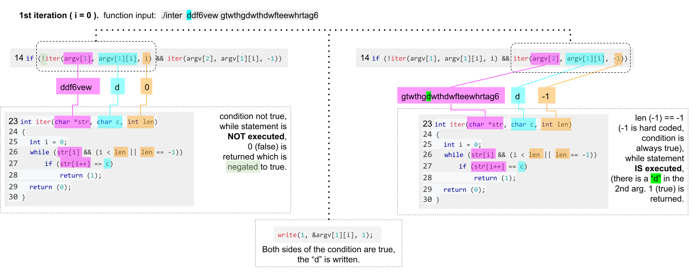
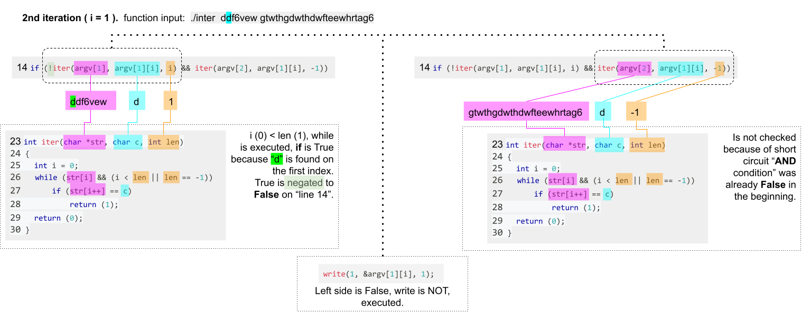

# Inter

_source:_ test the code in [pythontutor](https://pythontutor.com/c.html#mode=edit)

The algorithm has to write the characters which are matching in the two input strings but no character can be written doubled.  
The problem is to prevent the same characters being written more than once.

<details> 
    <summary>Subject</summary>

    Assignment name  : inter
    Expected files   : inter.c
    Allowed functions: write
    --------------------------------------------------------------------------------

    Write a program that takes two strings and displays, without doubles, the
    characters that appear in both strings, in the order they appear in the first
    one.

    The display will be followed by a \n.

    If the number of arguments is not 2, the program displays \n.

    Examples:

    $>./inter "padinton" "paqefwtdjetyiytjneytjoeyjnejeyj" | cat -e
    padinto$
    $>./inter ddf6vewg64f gtwthgdwthdwfteewhrtag6h4ffdhsd | cat -e
    df6ewg4$
    $>./inter "rien" "cette phrase ne cache rien" | cat -e
    rien$
    $>./inter | cat -e
    $

</details>

import Tabs from '@theme/Tabs';
import TabItem from '@theme/TabItem';

<Tabs>
  <TabItem value="code" label="Source Code" default>

```c showLineNumbers
#include <unistd.h>

int	iter(char *str, char c, int len);

int	main(int argc, char *argv[])
{
	int	i;

	if (argc == 3)  // only if 2 arguments
	{
		i = 0;
        // highlight-start
		while (argv[1][i])
		{
			if (!iter(argv[1], argv[1][i], i) && iter(argv[2], argv[1][i], -1))
				write(1, &argv[1][i], 1);
			i++;
		}
        // highlight-end
	}
	write(1, "\n", 1);
	return (0);
}

int	iter(char *str, char c, int len)
{
	int	i = 0;
// highlight-start
	while (str[i] && (i < len || len == -1))
		if (str[i++] == c)
// highlight-end
			return (1);
	return (0);
}
```

  </TabItem>
  <TabItem value="line12-17" label="-> line: 12-17">

```c showLineNumbers
while (argv[1][i])
{
            // highlight-start
	if (!iter(argv[1], argv[1][i], i) && iter(argv[2], argv[1][i], -1))
            // highlight-end
		write(1, &argv[1][i], 1);
	i++;
}
```

- **line 1:** We iterate over the first input string (_NOTE: `argv[0]` would be the name of the program_).
- **line 3:** The condition has two parts which both need to be true:
  1. `!iter(argv[1], argv[1][i], i)`: If the "current character" (_`argv[1][i]`_) came already **before** in the "1st input string". A `true` return would be **negated** to `false` and break the condition.
  2. `iter(argv[2], argv[1][i], -1)`: If the "current character" is any where present (_`-1`_) in the "2nd input string" (_`iter(argv[2]`_).
- **line 4:** If the "current character" came not before (_has not been already written_) and there is a match in the "2nd input string", then the "current character" is written.

</TabItem>
<TabItem value="iter()" label="-> line 23: 'iter()'">

```c showLineNumbers
int	iter(char *str, char c, int len)
{
	int	i = 0;
// highlight-start
	while (str[i] && (i < len || len == -1))
		if (str[i++] == c)
// highlight-end
			return (1);
	return (0);
}
```

</TabItem>

<TabItem value="pythontutor" label="pythontutor">

_NOTE: The "source code" has been adapted to make it work with the "python tutor"_  
_link to_ ["python tutor example"](https://pythontutor.com/render.html#code=%23include%20%3Cunistd.h%3E%0A%0Aint%20iter%28char%20*str,%20char%20c,%20int%20len%29%3B%0A%0Aint%20main%28void%29%0A%7B%0A%20%20%20%20int%20i%3B%0A%20%20%20%20char%20*argv%5B3%5D%20%3D%20%7B%22inter%22,%20%22ok%22,%20%22kaoaol%22%7D%3B%0A%0A%20%20%20%20%20%20%20%20i%20%3D%200%3B%0A%20%20%20%20%20%20%20%20while%20%28argv%5B1%5D%5Bi%5D%29%0A%20%20%20%20%20%20%20%20%7B%0A%20%20%20%20%20%20%20%20%20%20%20%20if%20%28!iter%28argv%5B1%5D,%20argv%5B1%5D%5Bi%5D,%20i%29%20%26%26%20iter%28argv%5B2%5D,%20argv%5B1%5D%5Bi%5D,%20-1%29%29%0A%20%20%20%20%20%20%20%20%20%20%20%20%20%20%20%20write%281,%20%26argv%5B1%5D%5Bi%5D,%201%29%3B%0A%20%20%20%20%20%20%20%20%20%20%20%20i%2B%2B%3B%0A%20%20%20%20%20%20%20%20%7D%0A%20%20%20%20write%281,%20%22%5Cn%22,%201%29%3B%0A%20%20%20%20return%20%280%29%3B%0A%7D%0A%0Aint%20iter%28char%20*str,%20char%20c,%20int%20len%29%0A%7B%0A%20%20%20%20int%20i%20%3D%200%3B%0A%20%20%20%20while%20%28str%5Bi%5D%20%26%26%20%28i%20%3C%20len%20%7C%7C%20len%20%3D%3D%20-1%29%29%0A%20%20%20%20%20%20%20%20if%20%28str%5Bi%2B%2B%5D%20%3D%3D%20c%29%0A%20%20%20%20%20%20%20%20%20%20%20%20return%20%281%29%3B%0A%20%20%20%20return%20%280%29%3B%0A%7D&cumulative=false&curInstr=0&heapPrimitives=nevernest&mode=display&origin=opt-frontend.js&py=c_gcc9.3.0&rawInputLstJSON=%5B%5D&textReferences=false)

<iframe width="1200" height="750" frameborder="0" src="https://pythontutor.com/iframe-embed.html#code=%23include%20%3Cunistd.h%3E%0A%0Aint%20iter%28char%20*str,%20char%20c,%20int%20len%29%3B%0A%0Aint%20main%28void%29%0A%7B%0A%20%20%20%20int%20i%3B%0A%20%20%20%20char%20*argv%5B3%5D%20%3D%20%7B%22inter%22,%20%22ok%22,%20%22kaoaol%22%7D%3B%0A%0A%20%20%20%20%20%20%20%20i%20%3D%200%3B%0A%20%20%20%20%20%20%20%20while%20%28argv%5B1%5D%5Bi%5D%29%0A%20%20%20%20%20%20%20%20%7B%0A%20%20%20%20%20%20%20%20%20%20%20%20if%20%28!iter%28argv%5B1%5D,%20argv%5B1%5D%5Bi%5D,%20i%29%20%26%26%20iter%28argv%5B2%5D,%20argv%5B1%5D%5Bi%5D,%20-1%29%29%0A%20%20%20%20%20%20%20%20%20%20%20%20%20%20%20%20write%281,%20%26argv%5B1%5D%5Bi%5D,%201%29%3B%0A%20%20%20%20%20%20%20%20%20%20%20%20i%2B%2B%3B%0A%20%20%20%20%20%20%20%20%7D%0A%20%20%20%20write%281,%20%22%5Cn%22,%201%29%3B%0A%20%20%20%20return%20%280%29%3B%0A%7D%0A%0Aint%20iter%28char%20*str,%20char%20c,%20int%20len%29%0A%7B%0A%20%20%20%20int%20i%20%3D%200%3B%0A%20%20%20%20while%20%28str%5Bi%5D%20%26%26%20%28i%20%3C%20len%20%7C%7C%20len%20%3D%3D%20-1%29%29%0A%20%20%20%20%20%20%20%20if%20%28str%5Bi%2B%2B%5D%20%3D%3D%20c%29%0A%20%20%20%20%20%20%20%20%20%20%20%20return%20%281%29%3B%0A%20%20%20%20return%20%280%29%3B%0A%7D&codeDivHeight=400&codeDivWidth=350&cumulative=false&curInstr=0&heapPrimitives=nevernest&origin=opt-frontend.js&py=c_gcc9.3.0&rawInputLstJSON=%5B%5D&textReferences=false"> </iframe>

</TabItem>
</Tabs>

## Explanation

- The 1st condition on "line 14" is to check if the current character is part of the 1st argument but before the current iteration/ index. This way we check if it has not already been written, because if it is then we have written it before.
- The 2nd condition on "line 14" is only evaluated if the first was negated from false to true. Its job is to check if the current character is part of the 2nd argument.
- the function is used for two purposes:

  1. **if len is not -1**, used as 1st condition on "line 14": check if the character is part of string (1st arg) -> return true -> negated to **false**
  2. **if len is -1** used as 2nd condition on "line 14": check if the character is part of the string (2nd arg) -> return **true**

---

### 1st iteration



### 2nd iteration



### 3rd iteration


