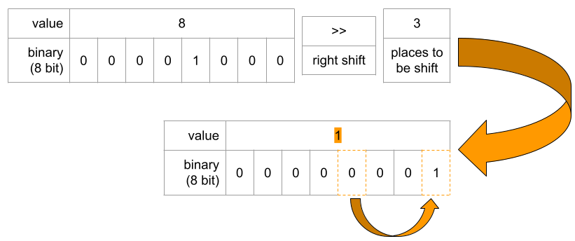
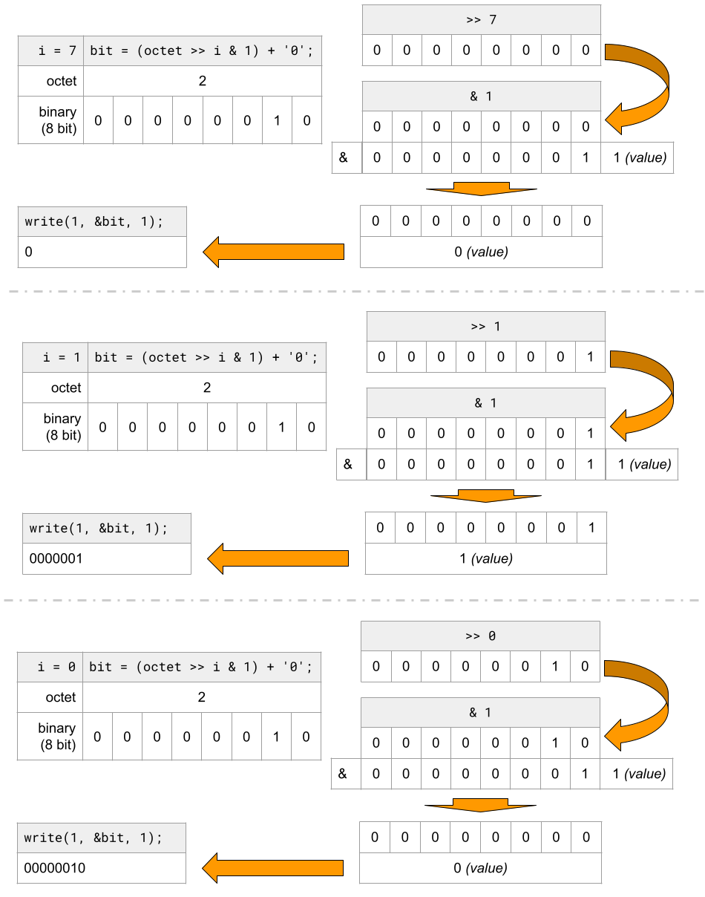

# print_bits

The function prints the binary value of of a single byte. E.g.: `2` -> `00000010`

<details>
  <summary>Subject</summary>

### Subject

    Assignment name  : print_bits
    Expected files   : print_bits.c
    Allowed functions: write
    --------------------------------------------------------------------------------

    Write a function that takes a byte, and prints it in binary WITHOUT A NEWLINE
    AT THE END.

    Your function must be declared as follows:

    void	print_bits(unsigned char octet);

    Example, if you pass 2 to print_bits, it will print "00000010"

</details>

```c showLineNumbers
void print_bits(unsigned char octet)
{
    int i = 8;
    unsigned char bit;

    while (i--)
    {
        bit = (octet >> i & 1) + '0';
        write(1, &bit, 1);
    }
}
```

<details>
  <summary>Bitwise Operator - Right shift >></summary>

### Bitwise Operator - Right shift >>

_source:_ [wikipedia.org/wiki/Bitwise_operations_in_C](https://en.wikipedia.org/wiki/Bitwise_operations_in_C)

It shifts each bit in its left operand to the right. The number following the operator decides the number of places the bits are shifted (i.e. the right operand). Thus by doing `8 >> 3` all the bits will be shifted to the right by three places and so on. The value changes to 1.  


:::caution
Do note that a shift operand value which is either a negative number or is greater than or equal to the total number of bits in this value results in undefined behavior. For example, when shifting a 32 bit unsigned integer, a shift amount of 32 or higher would be undefined.
:::

</details>

<details>
  <summary>Bitwise Operator - AND &</summary>

### Bitwise Operator - AND &

_source:_ [wikipedia.org/wiki/Bitwise_operations_in_C](https://en.wikipedia.org/wiki/Bitwise_operations_in_C)

The bitwise AND operator is a single ampersand: &. It is just a representation of AND which does its work on the bits of the operands rather than the truth value of the operands. Bitwise binary AND performs logical conjunction (shown in the table above) of the bits in each position of a number in its binary form.

| bit a | bit b | a & b (a AND b) |
| :---- | :---- | :-------------- |
| 0     | 0     | 0               |
| 0     | 1     | 0               |
| 1     | 0     | 0               |
| 1     | 1     | 1               |

_for instance, working with a byte (the char type):_

```text
     11001000
   & 10111000
     --------
   = 10001000
```

The most significant bit of the first number is 1 and that of the second number is also 1 so the [most significant bit](https://en.wikipedia.org/wiki/Bit_numbering#Most_significant_bit) of the result is 1; in the second most significant bit, the bit of second number is zero, so we have the result as 0.

</details>

<details>
  <summary>Code Explanation</summary>

### Code Explanation

#### Key Concepts

- **Unsigned Character:** In C, the unsigned char data type represents a character that can hold values from 0 to 255. It is commonly used to store binary data or ASCII characters.
- **Binary Representation:** Binary representation is a way of expressing data using only two digits, 0 and 1. It is the fundamental language of computers and is used to represent all types of data.

#### Code Structure

The print_bits function takes an unsigned character (`octet`) as a parameter and does the following:

- **line 3:** Initializes a counter variable `i` with the value 8. Because we need to print 8 bits.
- **line 4:** Declares an unsigned character variable `bit` to store the binary representation of each bit. For writing later on line 9.
- **line 6:** Enters a while loop that iterates 8 times (since we are dealing with an 8-bit octet).
- **line 8:** Inside the loop, the `bit` variable is assigned the binary representation of the current bit by performing a "bitwise right shift" (`>>`) operation on the `octet` parameter with the value of `i`, followed by a "bitwise AND" (`&`) operation with `1`. The result is then added to the character `'0'` to convert it to its ASCII representation.
- **line 9:** Finally, the `write` function is used to print the bit character to the standard output.



</details>
