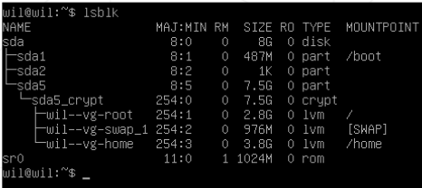
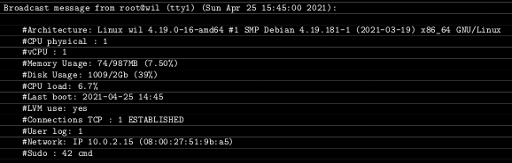
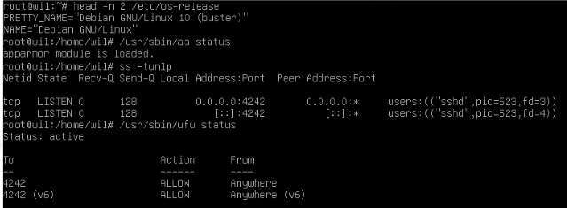

# Subject Overview

:::note Disclaimer

I wrote this notes for my future self, you are welcome to use them.

However, if you are a ["student at 42"](https://42london.com/?gclid=Cj0KCQiAhomtBhDgARIsABcaYymblp_EhP5j4kSNPZX1ATluiWf6Yg6bNBqERSdCIobNOHuG6ckKdQAaAkEBEALw_wcB) and you still have to finish that project, then please try first for your self.  
This way you will learn more, happy coding. :computer: :smile: :thumbsup:

P.S. If you have a GitHub account then you can "propose changes" to my side by clicking the "download edit" button at the bottom of the page. Any feedback would be very welcome, thank you.

:::

The goal is to create a virtual machine with "Debian" as a headless server (no graphical UI, only command line). Following features need to be implemented:

- LVM disk partitioning
- a strong password policy
- creating and regulating of the 'sudo' group
- remote SSH connection
- automated broadcast message with system report

## 01. Virtual Machine and OS

[ ] create a virtual machine with Virtual Box  
[ ] install the latest stable version of Debian  
[ ] only install the minimum of services (no graphical UI)  
[ ] hostname must be 42 login name with the suffix '42' (e.g. zkepes42)  
[ ] SELinux (adapt confi) and AppArmor must be running at startup  
[ ] at least 2 encrypted partitions using LVM, see example:  

## 02. UFW (uncomplicated fire wall)

[ ] must be active at startup  
[ ] open only port 4242

## 03. remote SSH connection

[ ] SSH server has to run on port 4242 only  
[ ] it must not be possible to connect using SSH as root

## 04. implement a strong password policy

[ ] expire every 30 days  
[ ] can only be changed 2 days after it was initially set up  
[ ] user has to receive warning message 7 days before expire  
[ ] at least 10 characters long  
[ ] must contain a number, uppercase and lowercase letter  
[ ] not more then 3 consecutive identical characters  
[ ] must not include the name of the user  
[ ] (not for root) must have at least 7 characters that are not part of the former password  
[ ] update existing password to the policy

## 05. create user

[ ] create a user with your "42 username" (e.g. zkepes)  
[ ] has to belong to the `user42` and `sudo` group

## 06. sudo with restrictions

[ ] 3 attempts to authentication before retrying  
[ ] custom message for wrong password  
[ ] each sudo action (inputs and outputs) has to be archived in the  
`/var/log/sudo/` directory  
[ ] TTY mode has to be enabled for security reasons  
[ ] restricting the environment variable `PATH` to:  
`/usr/local/sbin:/usr/local/bin:/usr/sbin:/usr/bin:/sbin:/bin:/snap/bin`

## 07. broadcast "system status" message

[ ] developed in bash and be named `monitoring.sh`  
[ ] run at server startup, on all terminals ever 10 minutes  
[ ] no visible error messages  
[ ] - architecture of your operating system and its kernel version  
[ ] - number of physical processors  
[ ] - number of virtual processors  
[ ] - current available RAM on your server and its utilization rate as a percentage  
[ ] - current available memory on your server and its utilization rate as a percentage  
[ ] - current utilization rate of your processors as a percentage  
[ ] - date and time of the last reboot  
[ ] - whether LVM is active or not  
[ ] - number of active connections  
[ ] - number of users using the server  
[ ] - IPv4 address of your server and its MAC (Media Access Control) address  
[ ] - number of commands executed with the sudo program  

## 08. commands to check some of the subjects requirements

- `head -n 2 /etc/os-release`: distribution and it's version
- `/usr/sbin/aa-status`: if AppArmor module is loaded
- `ss -tunlp`: [socket statistics](https://man7.org/linux/man-pages/man8/ss.8.html),
- `/usr/sbin/ufw status` ufw fire wall status (list open ports)  
  

## 09. submission

[ ] You only have to turn in a signature.txt file at the root of your repository.
