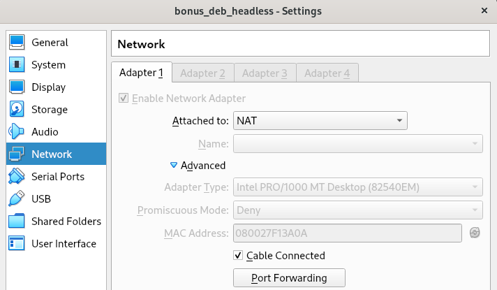
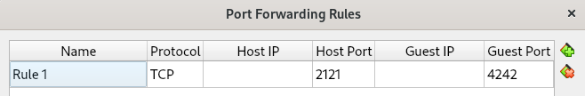
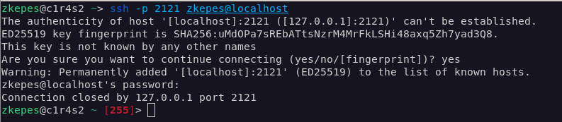
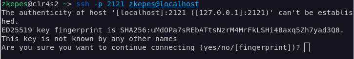

# Implementation

When I was reading the documents, I got often confused with the following terms:  
**Guest OS** is the operating system (Debian) which is installed **on the virtual machine** (VirtualBox), that is also where our **Server** is going to be.  
**Host OS** is the operating system (Ubuntu) which is installed **on our real machine**, that is where our **Client** is going to be.

**Conventions:**
Some commands may start with `#`, it means it should be run as **root** user, which is may be not all the time necessary (use `sudo`if needed).

## 01. installation

- use sgoinfre

---

## 02. UFW

source: [DigitalOcean](https://www.digitalocean.com/community/tutorials/how-to-set-up-a-firewall-with-ufw-on-debian-11-243261243130246d443771547031794d72784e6b36656d4a326e49732e)

Install "ufw" and enable it. After allow port "4242" and check the status.

|     description | command                   |
| --------------: | :------------------------ |
|     install ufw | `# apt-get install ufw`   |
|      enable ufw | `# ufw enable`            |
|     disable ufw | `# ufw disable`           |
| allow port 4242 | `# ufw allow 4242`        |
| close port 4242 | `# ufw delete allow 4242` |
|          verify | `# ufw status verbose`    |

---

## 03. SSH connection

### 03.01 setting up VirtualBox (VB)

Preparing for a SSH connection between the Host OS and the Guest OS.  
Our Guest OS can not be seen by the Host OS even if you use the correct Guest OS IP! To enable a connection we need set up "Port Forwarding" in VB, which works as a router for the Guest OS. We then use our localhost address to send a request to our self which will reach the VB on the specified port (e.g. 2121). Which then uses **N**etwork**A**ddress**T**ranslation to translates our localhost address to the Guest OS IP address.

1. right click on the "virtual machine" and choose "**Settings**" -> "**Network**"
2. choose a free "**Adapter**" and select under "**Attached to:**" "**NAT**"  
   
3. under **Advanced** select "**Port Forwarding**"
   - **Name** can be anything you want - **Host IP** leave blank, VirtualBox knows the Host OS IP - **Host Port** e.g. `2121`, port on which the Host OS is conneting, must be free (use `netstat -lntu` to see which ports are already used e.g.:  
     `tcp        0      0 0.0.0.0:22              0.0.0.0:*               LISTEN` means port 22 is already taken)
   - **Guest IP** needs to be the ip of the Guest OS, use `hostname -I` on the Guest machine to find it, should be `10.0.2.15` - **Guest Port** `4242`, the port to wich the Guest OS will be listening, use "4242" because that is the only port which we are allowed to open  
       
     **NOTE:** You need to restart your Guest OS if you make changes in the settings while it is running for the changes to take effect.

### 03.02 preparing the Guest OS

1. check if the ssh.service is active (must be active on both machines): `systemctl status ssh`
   - if not then start it: `sudo systemctl start sshd`
   - enable it to run after booting: `sudo systemctl enable sshd`
   - otherwise you need to install it **OpenSSH** (you could also install client and server on both OS):
     - client for the Host OS: `apt install openssh-client`
     - server for the Guest OS: `apt install openssh-server`
2. change the default port (22) to which the sshd server is listening to:
   - open:`nano /etc/ssh/sshd_config`
   - change `Port 22` to `Port 4242`
   - after making any changes we need to reload: `systemctl reload ssh`

### 03.03 connect from Host OS

#### connecting to a ssh server which is NOT a VirtualBox

In that case we would not send a request to ourself, but to the IP address to where we want to connect to.

| ssh command | port (lowercalse p) for connection | name of user we want to connect to | at  | IP address **to where we want to connect to** |
| :---------: | :--------------------------------: | :--------------------------------: | --- | --------------------------------------------- |
|    `ssh`    |             `-p` 9999              |              USERNAME              | `@` | SERVER_IP                                     |

#### connecting to a ssh server which IS a VirtualBox

We can not conncet direct to the server, we need to send a request to our self (VirtualBox) which will be translated to the address of the server.

| ssh command | port (lowercalse p) for connection, if no port is specified then port "22"is assumed" | name of user we want to connect to | at  | Host OS IP address, can be replaced with the keyword `localhost` |
| :---------: | :-----------------------------------------------------------------------------------: | :--------------------------------: | --- | ---------------------------------------------------------------- |
|    `ssh`    |                                       `-p` 9999                                       |              USERNAME              | `@` | HOST_OS_IP                                                       |

1. open a terminal and run: `ssh -p 2121 zkepes@localhost`
   - the first time you run this command you will be ask if ... `you want to continue connectin` ... type `yes`
     
   - enter your password, may be the connecton will lost, run `ssh -p 2121 zkepes@localhost` again, this time the fingerprint will be saved
     
2. troubleshooting:

- If you get a message like that in the furture, then you should be carefull!

```bash showLineNumbers
@@@@@@@@@@@@@@@@@@@@@@@@@@@@@@@@@@@@@@@@@@@@@@@@@@@@@@@@@@@
@    WARNING: REMOTE HOST IDENTIFICATION HAS CHANGED!     @
@@@@@@@@@@@@@@@@@@@@@@@@@@@@@@@@@@@@@@@@@@@@@@@@@@@@@@@@@@@
IT IS POSSIBLE THAT SOMEONE IS DOING SOMETHING NASTY!
Someone could be eavesdropping on you right now (man-in-the-middle attack)!
It is also possible that a host key has just been changed.
The fingerprint for the ED25519 key sent by the remote host is
SHA256:uMdOPa7sREbATtsNzrM4MrFkLSHi48axq5Zh7yad3Q8.
Please contact your system administrator.
Add correct host key in /nfs/homes/zkepes/.ssh/known_hosts to get rid of this message.
Offending ED25519 key in /nfs/homes/zkepes/.ssh/known_hosts:8
  remove with:
  ssh-keygen -f "/nfs/homes/zkepes/.ssh/known_hosts" -R "[10.11.4.8]:4242"
Host key for [10.11.4.8]:4242 has changed and you have requested strict checking.
Host key verification failed.
```

- But for the scope of this project, you can just go to `/nfs/homes/zkepes/.ssh/known_hosts` and delete line `:8` (_your path_) and it run again

## 03.04 copy files over an SSH server

_source:_ [cyberpanel.net](https://cyberpanel.net/transfer-files-over-ssh/#:~:text=Typically%2C%20one%20of%20the%20regular,is%20the%20way%20to%20go.)

### copy from client (Host OS) to a server (Guest OS):

- **NOTE:** the uppercase **P** and this is a connection to a VirtualBox (HOST_IP)
  - **syntax:** `scp -P [PORT] <SOURCE_PATH> <USERNAME@HOST_IP>:<DESTENATION_PATH>`
  - **projcect:** `scp -P 2121 ~/42cursus/monitoring.sh  zkepes@localhost:~/.`
  - _explanation: copies from the home directory of the user /42cursus/ the file monitoring.sh to the home directory of the server (Guest OS) user "zkepes"_

### copy from server (Guest OS) to our client (Host OS):

- **NOTE:** the uppercase **P** and this is a connection to a VirtualBox (HOST_IP)
  - **syntax:** `scp -P [PORT] <USERNAME@HOST_IP>:<SOURCE_PATH> <DESTENATION_PATH>`
  - **projcect:** `scp -P 2121 zkepes@localhost:~/getMe.txt ~/42cursus`
  - _explanation: copies from the home directory of the user "zkepes" the file "getMe.txt" to the home directory of the client (Host OS)_

---

## 04. implementing a strong password policy

### 04.01 modifying login.defs

1. Open the `/etc/login.defs` and change the following lines, this will only apply to new user.  
   _source:_ [LinuxTechi](https://www.linuxtechi.com/enforce-password-policies-linux-ubuntu-centos/)

   | login.defs file  | description                                                            |
   | :--------------- | :--------------------------------------------------------------------- |
   | PASS_MAX_DAYS 30 | 30 days and the password expires                                       |
   | PASS_MIN_DAYS 2  | 2 the minimum of days before you can change your password again        |
   | PASS_WARN_AGE 7  | 7 days before the password expires the user receives a warning message |

2. Update the settings manually for the existing users with the `chage` command.  
   _source:_ [geeksforgeeks](https://www.geeksforgeeks.org/chage-command-in-linux-with-examples/)

   | command              | description                                                                        |
   | :------------------- | :--------------------------------------------------------------------------------- |
   | `chage -h`           | shows all available options                                                        |
   | `chage -l zkepes`    | shows the password settings for the user "zkepes"                                  |
   | `chage -M 30 zkepes` | changes the maximum days to 30 till the user "zkepes" has to set up a new password |

### 04.02 Setting PAM Modules

_source:_ [linux.com](https://www.linux.com/news/understanding-pam/)

**P**luggable **A**uthentication **M**odules is a collection of modules that essentially form a barrier between a service on your system, and the user of the service. The modules can have widely varying purposes, from disallowing a login to users from a particular UNIX group (or netgroup, or subnet…), to implement resource limits so that your ‘research’ group can’t hog system resources.  
The Modules are stacked, the outcome of an earlier module can influence the following modules.

#### libpam-pwquality

_source:_ [debian](https://manpages.debian.org/testing/libpam-pwquality/pam_pwquality.8.en.html), [redhat](https://access.redhat.com/documentation/en-us/red_hat_enterprise_linux/6/html/managing_smart_cards/pam_configuration_files)

Is a module which can be plugged to PAM. It perform's password checks.

1. install “libpam-pwquality” `# apt -y install libpam-pwquality`
2. open /etc/pam.d/common-password, the **pam_pwquality.so** module should aper above **pam_unix.so**
3. add the following module-flags behind the module **pam_pwquality.so** …

```bash title="/etc/pam.d/common-password"
password   requisite                    pam_pwquality.so retry=3 minlen=10 dcredit=-1 lcredit=-1 ucredit=-1 maxrepeat=3 difok=7 reject_username enforce_for_root
password   [success=1 default=ignore]   pam_unix.so obscure use_authtok  try_first_pass yescrypt
```

| flag               | discrioption                                                                                                     |
| :----------------- | :--------------------------------------------------------------------------------------------------------------- |
| `retry=3`          | This option will **prompt** the user **3 times** before exiting and returning an error.                          |
| `minlen=10`        | This specifies that the password **can not be less than 10** characters.                                         |
| `ucredit=-1`       | The option requires at least one **uppercase character** in the password.                                        |
| `lcredit=-1`       | The option requires at least one **lowercase character** in the password.                                        |
| `dcredit=-1`       | This implies that the password should have at last a **numeric character**.                                      |
| `maxrepeat=3`      | Set maximum number of allowed **consecutive same characters** in the new password.                               |
| `difok=7`          | The minimum number of characters that **must be different** from the old password                                |
| `reject_username`  | The option **rejects** a password if it consists of the **username** either in its normal way or in reverse.     |
| `enforce_for_root` | This ensures that the password policies are adhered to even if it’s the **root user** configuring the passwords. |

**TODO** add description how PAM works later!

---

## 05. Users and Groups

:::caution NOTE

Maybe you need to log in and out (`su`) for the **/etc/passwd** and **etc/group** file to update.

:::

### 05.01 users

We are going to use the `adduser` command to create new users.

1. check if you need to install `adduser --version`, if yes then install `apt-get install adduser`

#### create, delete, see user:

| command                  | description                                   |
| :----------------------- | :-------------------------------------------- |
| `sudo adduser zkepes`    | create a user with the name "zkepes"          |
| `sudo userdel -f zkepes` | forces (-f) the deletion of the user "zkepes" |
| `less /etc/passwd`       | lists all users                               |

#### content of the /etc/passwd file

| username |  x  | user ID (UID) | group ID (GID) | GECOS | home directory | default shell |
| :------: | :-: | :-----------: | :------------: | :---: | :------------: | ------------- |
| `zkepes` | `x` |    `1000`     |     `1000`     | `,,,` | `/home/zkepes` | `/bin/bash`   |

_source:_ [phoenixNAP](https://phoenixnap.com/kb/etc-passwd#:~:text=The%2Fetc%2Fpasswd%20file%20is,home%20directory%2C%20and%20default%20shell.)

- **username:** A unique string with a maximum length of 32 characters.
- **x:** The encrypted password stored in the /etc/shadow file.
- **UID:** The user ID (UID) is a unique number assigned to each user by the operating system.
- **GID:** The Group ID (GID) refers to the user's primary group. The primary group has the same name as the user. Secondary groups are listed in the /etc/groups file.
- **GECOS:** Represents the User ID Info (GECOS), the comment field containing additional information about the user. For example, the user's full name, phone number, and other contact details.
- **home directory:** The absolute path to the directory where users are placed when they log in. It contains the user's files and configurations.
- **default shell:** The user's default shell that starts when the user logs into the system.

:::info Linux users

Linux supports two types of users: **system users** and **regular users**. System users are created by the system during installation and are used to run system services and applications. Regular users are created by the administrator and can access the system and its resources based on their permissions.

:::

### 05.02 groups

_source:_ [nixCraft](https://www.cyberciti.biz/faq/understanding-etcgroup-file/)  
Unix file system permissions are organized into three classes, **user**, **group**, and **others**. The use of groups allows additional abilities to be delegated in an organized fashion, such as access to disks, printers, and other peripherals.

#### create, delete, see groups:

| command                                                                      | description                                      |
| :--------------------------------------------------------------------------- | :----------------------------------------------- |
| `groups`                                                                     | see which groups the "logged in user" belongs to |
| `less /etc/group` _or_ `getent group`                                        | see all groups and its members                   |
| `# groupadd GROUP_NAME`                                                      | creating a new group                             |
| `# groupdel GROUP_NAME`                                                      | delete group                                     |
| `# usermod -a -G GROUP_NAME USER_NAME` _or_ `# adduser USER_NAME GROUP_NAME` | add user to group                                |
| `# usermod -r -G GROUP_NAME USER_NAME`                                       | remove user from group                           |

#### content of the /etc/group file

| group name |  x  | group ID (GID) | Group List |
| :--------: | :-: | :------------: | :--------: |
|   user42   |  x  |      1001      |   zkepes   |

_after creating the "user42" group and adding the user "zkepes" to it_

- **group name:** It is the name of group. If you run ls -l command, you will see this name printed in the group field.
- **x:** Generally password is not used, hence it is empty/blank. It can store encrypted password. This is useful to implement privileged groups.
- **group ID (GID):** Each user must be assigned a group ID. You can see this number in your /etc/passwd file.
- **group list:** It is a list of user names of users who are members of the group. The user names, must be separated by commas.

---

## 06. Sudo

_source:_ [techtarget](https://www.techtarget.com/searchsecurity/definition/sudo-superuser-do) [hostinger](https://www.hostinger.co.uk/tutorials/sudo-and-the-sudoers-file/#:~:text=If%20we%20use%20the%20grep,just%20add%20them%20to%20sudo.&text=The%20deluser%20command%20will%20remove,actions%20that%20require%20sudo%20privileges.)  
Temporarily grant users or user groups privileged access to system resources so that they can run commands that they cannot run under their regular accounts. Sudo also logs all commands and arguments so that administrators can track the behavior of sudo users. **Sudo** stands for `su` (the command itself allows to **s**witch **u**ser) and **do**.

### 06.01 setup and user assignment

1. check if you need to install `sudo --version`, if yes then install `apt-get install sudo`

#### adding, removing and seeing which user is in a group:

Sudo is treated like a group.

:::caution sudo power
Be carful, adding a user to the “sudo” group gives them the same privileges as root by default (adjust settings).

```bash title="/etc/sudoers"
# User privilege specification
root    ALL=(ALL:ALL) ALL
# Allow members of group sudo to execute any command
%sudo   ALL=(ALL:ALL) ALL
```

:::

| command                 | description                                   |
| :---------------------- | :-------------------------------------------- |
| `grep sudo /etc/group`  | list all users which belong to the Sudo group |
| `# adduser zkepes sudo` | add the user "zkepes" to the sudo group       |
| `# deluser zkepes sudo` | remove user "zkepes" from the sudo group      |

### 06.02 Sudo Settings and Privileges

_source:_ [sudo.ws](https://www.sudo.ws/docs/man/1.8.18/sudoers.man/)  
The **sudoers plugin** of sudo has many options to control the permissions context for a given command, user, or session.

1. change or adjust group privileges in the **/etc/sudoers** file
   - **sudoers** is read-only, you should use `sudo visudo /etc/sudoers` to make changes, **visudo** provides additional checking, but some text editors let you write changes anyway.
2. add or change the following lines:

   | command                                                                                          | description                                                                                                                                               |
   | :----------------------------------------------------------------------------------------------- | :-------------------------------------------------------------------------------------------------------------------------------------------------------- |
   | `Defaults badpass_message="Password is wrong, try again"`                                        | default error message if user enters wrong password                                                                                                       |
   | `Defaults logfile=”/var/log/sudo/sudo.log”`                                                      | un- or successful sudo attempts are logged in that file.                                                                                                  |
   | `Defaults requiretty`                                                                            | sudo will only run when the user is logged in to a real tty session                                                                                       |
   | `Defaults passwd_tries=3`                                                                        | The number of tries a user gets to enter his password before sudo logs the failure and exits.                                                             |
   | `Defaults secure_path= ”/usr/local/sbin:/usr/local/bin:/usr/sbin:/usr/bin:/sbin:/bin:/snap/bin”` | Only the environment variable at that path can be used when sudo is run. Meaning that only programs which are installed at that location can be executed. |

#### secure_path

_source:_ [askubuntu](https://askubuntu.com/questions/924037/which-could-be-the-risks-to-add-defaults-secure-path-home-username-in-etc)  
When a program is called, Linux looks in the "**environment-variable: PATH**" for it. It reads the path **from left to right** and stops looking as soon as it finds the program.
The **secure_path** setting restricts the "**environment-variable: PATH**" when **sudo** is called. The folders in that path should be write restricted, to prevent a malicious program from being saved there.

- _example:_ If a malicious program with the name "**apt**" where placed in a folder which comes before the folder of the real **apt** then it would be executed before the real one when you run for example `sudo apt update`.
- _tip:_ the `whereis` command shows you where a program is installed

#### requiretty

Specifies whether a terminal is required for a user to run commands with sudo. When requiretty is enabled, it means that users must run sudo commands from a terminal session, and they cannot use sudo in contexts where no terminal is available, such as in certain scripts or cron jobs.
