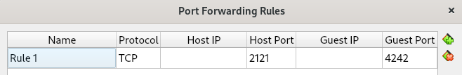
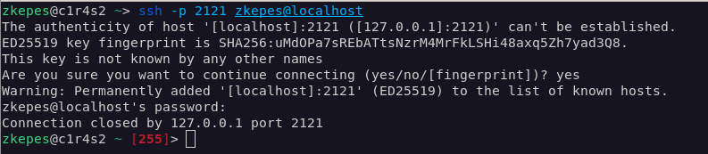
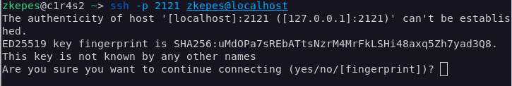

# Implementation
When I was reading the documents, I got often confused with the following terms:  
**Guest OS** is the operating system (Debian) which is installed **on the virtual machine** (VirtualBox), that is also where our **Server** is going to be.  
**Host OS** is the operating system (Ubuntu) which is installed **on our real machine**, that is where our **Client** is going to be.

**Conventions:**
Some commands may start with `#`, it means it should be run as **root** user, which is may be not all the time neccesary (use `sudo`if needed).

## 01. installation
- use sgoinfre

---
## 02. UFW
source: [DigitalOcean](https://www.digitalocean.com/community/tutorials/how-to-set-up-a-firewall-with-ufw-on-debian-11-243261243130246d443771547031794d72784e6b36656d4a326e49732e)

|description | command|
|:---:|:---:|
|install ufw |`# apt-get install ufw` |
|enable ufw |`# ufw enable` |
|disable ufw |`# ufw disable` |
|allow port 4242 |`# ufw allow 4242`|
|close port 4242 |`# ufw delete allow 4242` |
|verify |`# ufw status verbose` |

---
## 03. SSH connection
### 03.01 setting up VirtualBox
Preparing for a SSH connection between the Host OS and the Guest OS.  
Our Guest OS can not be seen by the Host OS even if you use the correct Guest OS IP! To enable a connection we need set up "Port Forwarding" in VirtualBox, which works as a router for the Guest OS. We then use our localhost addrees to send a request to our self which will reach the VirtualBox on the specifid port (e.g. 2121). Which then uses **N**etwork**A**ddress**T**ranslation to translates our localhost address to the Guest OS IP addresse.
1. right click on the "virtual machine" and choose "**Settings**" -> "**Network**"
2. choose a free "**Adapter**" and select under "**Attached to:**" "**NAT**"  

3. under **Advanced** select "**Port Forwarding**"  
    - **Name** can be anything you want
    - **Host IP** leave blank, VirtualBox knows the Host OS IP
    - **Host Port** e.g. `2121`, port on which the Host OS is conneting, must be free (use `netstat -lntu` to see which ports are already used e.g.:  
    `tcp        0      0 0.0.0.0:22              0.0.0.0:*               LISTEN` means port 22 is already taken)  
    - **Guest IP** needs to be the ip of the Guest OS, use `hostname -I` on the Guest machine to find it, should be `10.0.2.15`
    - **Guest Port** `4242`, the port to wich the Guest OS will be listening, use "4242" because that is the only port which we are allowed to open

**NOTE:** You need to restart your Guest OS if you make changes in the settings while it is running for the changes to take effect.

### 03.02 preparing the Gues OS
1. check if the ssh.service is active (must be active on both machines): `systemctl status ssh`
    - if not then start it: `sudo systemctl start sshd`
    - enable it to run after booting: `sudo systemctl enable sshd`
    - otherwise you need to install it **OpenSSH** (you could also install client and server on both OS):
        - client for the Host OS: `apt install openssh-client`
        - server for the Gues OS: `apt install openssh-server`
2. change the default port (22) to which the sshd server is listening to:  
    - open:`nano /etc/ssh/sshd_config`
    - change `Port 22` to `Port 4242`
    - after making any changes we need to reload: `systemctl reload ssh`

### 03.03 connect from Host OS
#### connecting to a ssh server which is NOT a VirtualBox
In that case we would not send a request to ourself, but to the IP address to where we want to connect to.
|ssh command |port (lowercalse p) for connection|name of user we want to connect to|at |IP address **to where we want to connect to** |
|:---:|:---:|:---:|
|`ssh`|`-p` 9999 |USERNAME |`@`| SERVER_IP|

#### connecting to a ssh server which IS a VirtualBox
We can not conncet direct to the server, we need to send a request to our self (VirtualBox) which will be translated to the address of the server.
|ssh command |port (lowercalse p) for connection, if no port is specified then port "22"is assumed"|name of user we want to connect to|at |Host OS IP address, can be replaced with the keyword `localhost` |
|:---:|:---:|:---:|
|`ssh`|`-p` 9999 |USERNAME |`@`| HOST_OS_IP|

1. open a terminal and run: `ssh -p 2121 zkepes@localhost`  
    - the first time you run this command you will be ask if ... `you want to continue connectin` ... type `yes`
    
    - enter your password, may be the connecton will lost, run `ssh -p 2121 zkepes@localhost` again, this time the fingerprint will be saved
    
2. troubleshooting:
- If you get a message like that in the furture, then you should be carefull!
```bash
@@@@@@@@@@@@@@@@@@@@@@@@@@@@@@@@@@@@@@@@@@@@@@@@@@@@@@@@@@@
@    WARNING: REMOTE HOST IDENTIFICATION HAS CHANGED!     @
@@@@@@@@@@@@@@@@@@@@@@@@@@@@@@@@@@@@@@@@@@@@@@@@@@@@@@@@@@@
IT IS POSSIBLE THAT SOMEONE IS DOING SOMETHING NASTY!
Someone could be eavesdropping on you right now (man-in-the-middle attack)!
It is also possible that a host key has just been changed.
The fingerprint for the ED25519 key sent by the remote host is
SHA256:uMdOPa7sREbATtsNzrM4MrFkLSHi48axq5Zh7yad3Q8.
Please contact your system administrator.
Add correct host key in /nfs/homes/zkepes/.ssh/known_hosts to get rid of this message.
Offending ED25519 key in /nfs/homes/zkepes/.ssh/known_hosts:8
  remove with:
  ssh-keygen -f "/nfs/homes/zkepes/.ssh/known_hosts" -R "[10.11.4.8]:4242"
Host key for [10.11.4.8]:4242 has changed and you have requested strict checking.
Host key verification failed.
```
- But for the scope of this project, you can just go to `/nfs/homes/zkepes/.ssh/known_hosts` and delete line `:8` (*your path*), run again 

## 03.04 copy files over an SSH server
source: [cyberpanel.net](https://cyberpanel.net/transfer-files-over-ssh/#:~:text=Typically%2C%20one%20of%20the%20regular,is%20the%20way%20to%20go.)

### copy from client (Host OS) to a server (Guest OS):
- **NOTE:** the uppercase **P** and this is a connection to a VirtualBox (HOST_IP)  
    - **syntax:**   `scp -P [PORT] <SOURCE_PATH> <USERNAME@HOST_IP>:<DESTENATION_PATH>`
    - **projcect:** `scp -P 2121 ~/42cursus/monitoring.sh  zkepes@localhost:~/.`
    - *explanation: copies from the home directory of the user /42cursus/ the file monitoring.sh to the home directory of the server (Guest OS) user "zkepes"*

### copy from server (Guest OS) to our client (Host OS):
- **NOTE:** the uppercase **P** and this is a connection to a VirtualBox (HOST_IP)  
    - **syntax:**   `scp -P [PORT] <USERNAME@HOST_IP>:<SOURCE_PATH> <DESTENATION_PATH>`
    - **projcect:** `scp -P 2121 zkepes@localhost:~/getMe.txt ~/42cursus`
    - *explanation: copies from the home directory of the user "zkepes" the file "getMe.txt" to the home directory of the client (Host OS)*