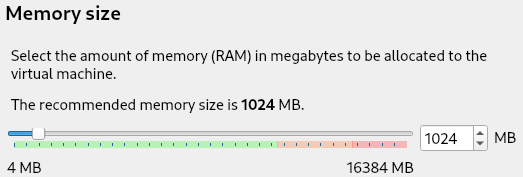
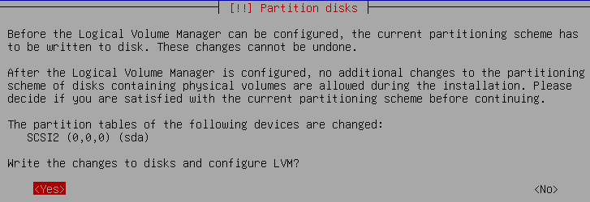

# Implementation

When I was reading the documents, I got often confused with the following terms:  
**Guest OS** is the operating system (Debian) which is installed **on the virtual machine** (VirtualBox), that is also where our **Server** is going to be.  
**Host OS** is the operating system (Ubuntu) which is installed **on our real machine**, that is where our **Client** is going to be.

**Conventions:**
Some commands may start with `#`, it means it should be run as **root** user, which is may be not all the time necessary (use `sudo`if needed).

## 01. installation

### 01.01 download debian ISO

1. follow the [link](https://www.debian.org/distrib/) or goole "install Debian"
2. under "Download an installation image" click on "**64-bit PC netinst iso**"  
   
   - **NOTE:** It has to be the **latest** but **stable** version of Debian!

### 01.02 install a "virtual machine"

1. open VirtualBox and create a new "virtual machine"
   - click on "**Tools**" -> "**New**"
     
2. set the "**name**" and "**operating system**"
   - **NOTE:** 42 projects: use `/nfs/sgoinfre/goinfre/Perso/zkepes/VirtualBox VMs`, replace `zkepes` with your user name (_more space_).  
     
3. set "**Memory size**" to `1024` MB  
   
4. set "**Hard disk**"  
   
5. set "**Hard disk file type**"  
   
6. set "**Storage on physical hard disk**"  
   
7. set "**File location and size**"  
   

:::tip take snapshots (backup)
VB has a feature which allows you to take snapshots. You can later "restore" a previous stage if things go wrong.  
Select your "virtual machine" (_e.g. "deb_headless"_) and ...  
**Take a snapshot:** choose "**Current State**" -> click "**Take**".
  
**NOTE:** the "current state" of your VM gets lost if you not take a "snapshot" from it before "restoring"!  
**Restore a snapshot:** select the "snapshot" you want to restore -> click "**Restore**"  
:::

- to start a "virtual machine" -> select "**Current State**" -> click "**Start**"

### 01.03 install Debian

1. "**start**" you "virtual machine" (_see ["03. How to start Debian?"](#03-how-to-start-debian)_)
2. set **Select start-up disk** -> click the "little yellow icon"  
     
   -> add your Debian installations image (_ISO_)  
   
3. **installation method:** choose `install` (_use your "arrow keys" to navigate the menu, "ENTER" to confirm_)
4. **Select a language:** -> `English`
5. **Select your location:** -> `United Kingdom`
6. **Configure the keyboard:** -> `American English` (_keybord in 42 London is "American English"_)
7. **Configure the network:** **HOSTname:** -> `zkepes42` (_your 42 login name + "42"_)
8. **Configure the network:** **Domain name:** -> what ever you like, e.g. `deb`
9. **Set up usrs and passwords:**
   - **NOTE:** Note your passwords, use pattern: 10 char long, upper case, lower case, digit, not username!
   - **Root password:** -> e.g. `Born2BeRoot`
   - **Full name for the new user:** e.g. `Zoltan Kepes` (_your full name_)
   - **Username for your account:** e.g. `zkepes` (_your 42 loging name_)
   - **Choose a password for the new user:** e.g. `London2023`
10. **Partition disk:**
    - **Partitioning method:** -> `Guided - use entire disk and set up encrypted LVM`
    - **Select disk to partition:** -> _there should be only one to choose from_
    - **Partitioning scheme:** -> `Separate /home partition`
    - -> confirm your settings with `<YES>`  
      
    - **Encryption passphrase:** -> e.g. `42DiskSpace`
    - **Amount of volume group ...:** -> leave the suggested setting `8.1 GB`
    - **Overview:** -> leave the suggested setting `Finish partitioning and write changes to disk`
      - **Write the changes to disk?** -> `<Yes>`  
        
11. **Configure the package manager:**
    - **Scam extra installation media?** -> `<No>`
    - **Debian archive mirror country:** -> `United Kingdom`
    - **Debian archive mirror:** -> `deb.debian.org`
    - **HTTP proxy information:** -> leave blank
    - **Participate in the package usage survey?:** -> `<No>`
12. **Software selection:** -> only install `[*] SSH server` and `[*] standard system utilities` -> confirm with "ENTER"  
    
13. **Configuring grub-pc:**
    - **Install the GRUB boot loader to your primary drive?:** -> `<Yes>`
    - **Device for loader installation:** -> `/dev/sda (ata-VBOX_HARDDISK_VB1c` (_there should be only one apart from "Enter device manually"_)
14. **Finish the installation:** -> `<Continue>`

- the OS will reboot, for now just shutdown with the `shutdown` command or click the VB menu (x on the top right) -> "

---

## 02. Set up VirtualBox (VB)

<details>
    <summary>Why we need to set up VB?</summary> 
    Our Guest OS can not be seen by the Host OS even if you use the correct Guest OS IP! To enable a connection we need set up "Port Forwarding" in VB, which works as a router for the Guest OS. We then use our localhost address to send a request to our self which will reach the VB on the specified port (e.g. 2121). Which then uses <b>N</b>etwork<b>A</b>ddress<b>T</b>ranslation to translates our localhost address to the Guest OS IP address.
</details>

#### Virtual Box Menu

1. right click on the "virtual machine" and choose "**Settings**" -> "**Network**"
2. choose a free "**Adapter**" and select under "**Attached to:**" "**NAT**"  
   
3. under **Advanced** select "**Port Forwarding**" -> click the small green button on the side "**Adds new port forwarding rule.**"
   - **Name** can be anything you want
   - **Host IP** leave blank, VirtualBox knows the Host OS IP
   - **Host Port** e.g. `2121`, port on which the Host OS is connecting, must be free (use `netstat -lntu` to see which ports are already used e.g.: `tcp        0      0 0.0.0.0:22              0.0.0.0:*               LISTEN` means port 22 is already taken)
   - **Guest IP** leave blank, VirtualBox knows the Guest OS IP
   - **Guest Port** `4242`, the port to which the Guest OS will be listening, use "4242" because that is the only port which we are allowed to open for the project  
       
     **NOTE:** You need to restart your Guest OS if you make changes in the settings while it is running for the changes to take effect.

## 03. How to start Debian?

1. in the "VirtualBox" menu:
   - select your "virtual machine" ("_deb_headless_server_") -> select "**Current State**" (_if you have created a snapshot_) -> click "**Start**"  
      
2. -> select `*Degian GNU/Linux` -> **ENTER**
3. **Please unlock disk sda5_crypt:** -> _enter the password which you have choosen for `Encryption passphrase`_ -> `42DiskSpace`  
   **NOTE:** You can not see any of the characters when you are typing a password in Linux, but they are there.
4. login with **your** credentials, for now as root (_as long we have not set up **sudo**_): e.g. login: `root` Password: `Born2BeRoot`

## 04. UFW

source: [DigitalOcean](https://www.digitalocean.com/community/tutorials/how-to-set-up-a-firewall-with-ufw-on-debian-11-243261243130246d443771547031794d72784e6b36656d4a326e49732e)

- update your package list `apt update` and if needed upgrade your packages after with `apt upgrade`
- Install "ufw" and enable it. After allow port "4242" and check the status.

|     description | command                   |
| --------------: | :------------------------ |
|     install ufw | `# apt install ufw`       |
|      enable ufw | `# ufw enable`            |
|     disable ufw | `# ufw disable`           |
| allow port 4242 | `# ufw allow 4242`        |
| close port 4242 | `# ufw delete allow 4242` |
|          verify | `# ufw status verbose`    |

- you should get the following return after running `ufw status verbose`  
  

---

## 05. SSH connection

### 05.01 preparing the Guest OS

1. check if the ssh.service is active (must be active on both machines): `systemctl status ssh`  
    
   <details>
      <summary>How set up SSH service if not active?</summary>
      <h2>Command not found</h2>
     You need to install it <b>OpenSSH</b> (you can install client and server on both OS):
      <ul>
         <li>client for the Host OS (Ubuntu): <code>apt install openssh-client</code></li>
         <li>server for the Guest OS (Debian): <code>apt install openssh-server</code></li>
      </ul>
      <h2>Service not active</h2>
      <ul>
         <li>activate service: <code>sudo systemctl start sshd</code></li>
         <li>enable it to run after booting: <code>sudo systemctl enable sshd</code></li>
      </ul>
   </details>

2. change the default port (22) to which the "sshd server" is listening to "**4242**":
   - open:`nano /etc/ssh/sshd_config`
   - change `Port 22` to `Port 4242`
   - after making any changes we need to reload: `systemctl reload ssh`

### 05.02 connect from Host OS

#### connecting to a ssh server which is NOT a VirtualBox

In that case we would not send a request to ourself, but to the IP address to where we want to connect to.

| ssh command | port (lowercase p) for connection | name of user we want to connect to | at  | IP address **to where we want to connect to** |
| :---------: | :-------------------------------: | :--------------------------------: | --- | --------------------------------------------- |
|    `ssh`    |             `-p` 9999             |              USERNAME              | `@` | SERVER_IP                                     |

#### connecting to a ssh server which IS a VirtualBox

We can not connect direct to the server, we need to send a request to our self (VirtualBox) which will be translated to the address of the server.

| ssh command | port (lowercalse p) for connection, if no port is specified then port "22"is assumed" | name of user we want to connect to | at  | Host OS IP address, can be replaced with the keyword `localhost` |
| :---------: | :-----------------------------------------------------------------------------------: | :--------------------------------: | --- | ---------------------------------------------------------------- |
|    `ssh`    |                                       `-p` 9999                                       |              USERNAME              | `@` | HOST_OS_IP                                                       |

1. open a terminal and run: `ssh -p 2121 zkepes@localhost`
   - the first time you run this command you will be ask if ... `you want to continue connectin` ... type `yes`
     
   - enter your password, may be the connecton will lost, run `ssh -p 2121 zkepes@localhost` again, this time the fingerprint will be saved
     
2. troubleshooting:

- If you get a message like that in the furture, then you should be carefull!

```bash showLineNumbers
@@@@@@@@@@@@@@@@@@@@@@@@@@@@@@@@@@@@@@@@@@@@@@@@@@@@@@@@@@@
@    WARNING: REMOTE HOST IDENTIFICATION HAS CHANGED!     @
@@@@@@@@@@@@@@@@@@@@@@@@@@@@@@@@@@@@@@@@@@@@@@@@@@@@@@@@@@@
IT IS POSSIBLE THAT SOMEONE IS DOING SOMETHING NASTY!
Someone could be eavesdropping on you right now (man-in-the-middle attack)!
It is also possible that a host key has just been changed.
The fingerprint for the ED25519 key sent by the remote host is
SHA256:uMdOPa7sREbATtsNzrM4MrFkLSHi48axq5Zh7yad3Q8.
Please contact your system administrator.
Add correct host key in /nfs/homes/zkepes/.ssh/known_hosts to get rid of this message.
Offending ED25519 key in /nfs/homes/zkepes/.ssh/known_hosts:8
  remove with:
  ssh-keygen -f "/nfs/homes/zkepes/.ssh/known_hosts" -R "[10.11.4.8]:4242"
Host key for [10.11.4.8]:4242 has changed and you have requested strict checking.
Host key verification failed.
```

- But for the scope of this project, you can just go to `/nfs/homes/zkepes/.ssh/known_hosts` and delete line `:8` (_your path_) and it run again or just use the command stated in the message `ssh-keygen -f "/nfs/homes/zkepes/.ssh/known_hosts" -R "[10.11.4.8]:4242"`

## 03.04 copy files over an SSH server

_source:_ [cyberpanel.net](https://cyberpanel.net/transfer-files-over-ssh/#:~:text=Typically%2C%20one%20of%20the%20regular,is%20the%20way%20to%20go.)

### copy from client (Host OS) to a server (Guest OS):

- **NOTE:** the uppercase **P** and this is a connection to a VirtualBox (HOST_IP)
  - **syntax:** `scp -P [PORT] <SOURCE_PATH> <USERNAME@HOST_IP>:<DESTENATION_PATH>`
  - **projcect:** `scp -P 2121 ~/42cursus/monitoring.sh  zkepes@localhost:~/.`
  - _explanation: copies from the home directory of the user /42cursus/ the file monitoring.sh to the home directory of the server (Guest OS) user "zkepes"_

### copy from server (Guest OS) to our client (Host OS):

- **NOTE:** the uppercase **P** and this is a connection to a VirtualBox (HOST_IP)
  - **syntax:** `scp -P [PORT] <USERNAME@HOST_IP>:<SOURCE_PATH> <DESTENATION_PATH>`
  - **projcect:** `scp -P 2121 zkepes@localhost:~/getMe.txt ~/42cursus`
  - _explanation: copies from the home directory of the user "zkepes" the file "getMe.txt" to the home directory of the client (Host OS)_

---

## 04. implementing a strong password policy

### 04.01 modifying login.defs

1. Open the `/etc/login.defs` and change the following lines, this will only apply to new user.  
   _source:_ [LinuxTechi](https://www.linuxtechi.com/enforce-password-policies-linux-ubuntu-centos/)

   | login.defs file  | description                                                            |
   | :--------------- | :--------------------------------------------------------------------- |
   | PASS_MAX_DAYS 30 | 30 days and the password expires                                       |
   | PASS_MIN_DAYS 2  | 2 the minimum of days before you can change your password again        |
   | PASS_WARN_AGE 7  | 7 days before the password expires the user receives a warning message |

2. Update the settings manually for the existing users with the `chage` command.  
   _source:_ [geeksforgeeks](https://www.geeksforgeeks.org/chage-command-in-linux-with-examples/)

   | command              | description                                                                        |
   | :------------------- | :--------------------------------------------------------------------------------- |
   | `chage -h`           | shows all available options                                                        |
   | `chage -l zkepes`    | shows the password settings for the user "zkepes"                                  |
   | `chage -M 30 zkepes` | changes the maximum days to 30 till the user "zkepes" has to set up a new password |

### 04.02 Setting PAM Modules

_source:_ [linux.com](https://www.linux.com/news/understanding-pam/)

**P**luggable **A**uthentication **M**odules is a collection of modules that essentially form a barrier between a service on your system, and the user of the service. The modules can have widely varying purposes, from disallowing a login to users from a particular UNIX group (or netgroup, or subnet…), to implement resource limits so that your ‘research’ group can’t hog system resources.  
The Modules are stacked, the outcome of an earlier module can influence the following modules.

#### libpam-pwquality

_source:_ [debian](https://manpages.debian.org/testing/libpam-pwquality/pam_pwquality.8.en.html), [redhat](https://access.redhat.com/documentation/en-us/red_hat_enterprise_linux/6/html/managing_smart_cards/pam_configuration_files)

Is a module which can be plugged to PAM. It perform's password checks.

1. install “libpam-pwquality” `# apt -y install libpam-pwquality`
2. open /etc/pam.d/common-password, the **pam_pwquality.so** module should aper above **pam_unix.so**
3. add the following module-flags behind the module **pam_pwquality.so** …

```bash title="/etc/pam.d/common-password"
password   requisite                    pam_pwquality.so retry=3 minlen=10 dcredit=-1 lcredit=-1 ucredit=-1 maxrepeat=3 difok=7 reject_username enforce_for_root
password   [success=1 default=ignore]   pam_unix.so obscure use_authtok  try_first_pass yescrypt
```

| flag               | discrioption                                                                                                     |
| :----------------- | :--------------------------------------------------------------------------------------------------------------- |
| `retry=3`          | This option will **prompt** the user **3 times** before exiting and returning an error.                          |
| `minlen=10`        | This specifies that the password **can not be less than 10** characters.                                         |
| `ucredit=-1`       | The option requires at least one **uppercase character** in the password.                                        |
| `lcredit=-1`       | The option requires at least one **lowercase character** in the password.                                        |
| `dcredit=-1`       | This implies that the password should have at last a **numeric character**.                                      |
| `maxrepeat=3`      | Set maximum number of allowed **consecutive same characters** in the new password.                               |
| `difok=7`          | The minimum number of characters that **must be different** from the old password                                |
| `reject_username`  | The option **rejects** a password if it consists of the **username** either in its normal way or in reverse.     |
| `enforce_for_root` | This ensures that the password policies are adhered to even if it’s the **root user** configuring the passwords. |

**TODO** add description how PAM works later!

---

## 05. Sudo

_source:_ [techtarget](https://www.techtarget.com/searchsecurity/definition/sudo-superuser-do) [hostinger](https://www.hostinger.co.uk/tutorials/sudo-and-the-sudoers-file/#:~:text=If%20we%20use%20the%20grep,just%20add%20them%20to%20sudo.&text=The%20deluser%20command%20will%20remove,actions%20that%20require%20sudo%20privileges.)

:::info What is Sudo
Temporarily grant users or user groups privileged access to system resources so that they can run commands that they cannot run under their regular accounts. Sudo also logs all commands and arguments so that administrators can track the behavior of sudo users. <b>Sudo</b> stands for `su` (the command itself allows to <b>s</b>witch <b>u</b>ser) and <b>do</b>.
:::

### 05.01 setup and user assignment

1. check if you need to install `sudo --version`, if yes then install `apt install sudo`

#### adding, removing and seeing which user is in a group:

Sudo is treated like a group.

:::caution sudo power
Be carful, adding a user to the “sudo” group gives them the same privileges as root by default. (_You can configure user rights individually in **/etc/sudoers**_).

```bash title="/etc/sudoers"
# User privilege specification
root    ALL=(ALL:ALL) ALL
# Allow members of group sudo to execute any command
%sudo   ALL=(ALL:ALL) ALL
```

:::

| command                    | description                                   |
| :------------------------- | :-------------------------------------------- |
| `apt install sudo`         | install sudo                                  |
| `grep sudo /etc/group`     | list all users which belong to the Sudo group |
| `sudo adduser zkepes sudo` | add the user "zkepes" to the sudo group       |
| `sudo deluser zkepes sudo` | remove user "zkepes" from the sudo group      |

### 05.02 Sudo Settings and Privileges

_source:_ [sudo.ws](https://www.sudo.ws/docs/man/1.8.18/sudoers.man/)  
The **sudoers plugin** of sudo has many options to control the permissions context for a given command, user, or session.

1. change or adjust group privileges in the **/etc/sudoers** file
   - **sudoers** is read-only, you should use `sudo visudo /etc/sudoers` to make changes, **visudo** provides additional checking, but some text editors let you write changes anyway.
2. add or change the following lines:

   | command                                                                                          | description                                                                                                                                               |
   | :----------------------------------------------------------------------------------------------- | :-------------------------------------------------------------------------------------------------------------------------------------------------------- |
   | `Defaults badpass_message="Password is wrong, try again"`                                        | default error message if user enters wrong password                                                                                                       |
   | `Defaults logfile=”/var/log/sudo/sudo.log”`                                                      | un- or successful sudo attempts are logged in that file. NOTE: You may have to create the folder "sudo" for the path if it not exist.                     |
   | `Defaults requiretty`                                                                            | sudo will only run when the user is logged in to a real tty session                                                                                       |
   | `Defaults passwd_tries=3`                                                                        | The number of tries a user gets to enter his password before sudo logs the failure and exits.                                                             |
   | `Defaults secure_path= ”/usr/local/sbin:/usr/local/bin:/usr/sbin:/usr/bin:/sbin:/bin:/snap/bin”` | Only the environment variable at that path can be used when sudo is run. Meaning that only programs which are installed at that location can be executed. |

   _NOTE: A user is created even when the password setup fails. But the user will not have a password and can not log in (only root can help)._

#### requiretty

Specifies whether a terminal is required for a user to run commands with sudo. When requiretty is enabled, it means that users must run sudo commands from a terminal session, and they cannot use sudo in contexts where no terminal is available, such as in certain scripts or cron jobs.

#### secure_path

_source:_ [askubuntu](https://askubuntu.com/questions/924037/which-could-be-the-risks-to-add-defaults-secure-path-home-username-in-etc)  
When a program is called, Linux looks in the "**environment-variable: PATH**" for it. It reads the path **from left to right** and stops looking as soon as it finds the program.
The **secure_path** setting restricts the "**environment-variable: PATH**" when **sudo** is called. The folders in that path should be write restricted, to prevent a malicious programs from being saved there.

- _example:_ If a malicious program with the name "**apt**" where placed in a folder which comes before the folder of the real **apt** then it would be executed before the real one when you run for example `sudo apt update`.
- _tip:_ the `whereis` command shows you where a program is installed

---

## 06. Users and Groups

:::caution NOTE

Maybe you need to log in and out (`su`) for the **/etc/passwd** and **etc/group** file to update.

:::

### 06.01 users

We are going to use the `adduser` command to create new users.

1. check if you need to install `adduser --version`, if yes then install `apt install adduser`

#### create, delete, see user:

| command                  | description                                   |
| :----------------------- | :-------------------------------------------- |
| `sudo adduser zkepes`    | create a user with the name "zkepes"          |
| `sudo userdel -f zkepes` | forces (-f) the deletion of the user "zkepes" |
| `less /etc/passwd`       | lists all users                               |

#### content of the /etc/passwd file

| username |  x  | user ID (UID) | group ID (GID) | GECOS | home directory | default shell |
| :------: | :-: | :-----------: | :------------: | :---: | :------------: | ------------- |
| `zkepes` | `x` |    `1000`     |     `1000`     | `,,,` | `/home/zkepes` | `/bin/bash`   |

_source:_ [phoenixNAP](https://phoenixnap.com/kb/etc-passwd#:~:text=The%2Fetc%2Fpasswd%20file%20is,home%20directory%2C%20and%20default%20shell.)

- **username:** A unique string with a maximum length of 32 characters.
- **x:** The encrypted password stored in the /etc/shadow file.
- **UID:** The user ID (UID) is a unique number assigned to each user by the operating system.
- **GID:** The Group ID (GID) refers to the user's primary group. The primary group has the same name as the user. Secondary groups are listed in the /etc/groups file.
- **GECOS:** Represents the User ID Info (GECOS), the comment field containing additional information about the user. For example, the user's full name, phone number, and other contact details.
- **home directory:** The absolute path to the directory where users are placed when they log in. It contains the user's files and configurations.
- **default shell:** The user's default shell that starts when the user logs into the system.

:::info Linux users

Linux supports two types of users: **system users** and **regular users**. System users are created by the system during installation and are used to run system services and applications. Regular users are created by the administrator and can access the system and its resources based on their permissions.

:::

### 06.02 groups

_source:_ [nixCraft](https://www.cyberciti.biz/faq/understanding-etcgroup-file/)  
Unix file system permissions are organized into three classes, **user**, **group**, and **others**. The use of groups allows additional abilities to be delegated in an organized fashion, such as access to disks, printers, and other peripherals.

#### create, delete, see groups:

| command                                                                            | description                                      |
| :--------------------------------------------------------------------------------- | :----------------------------------------------- |
| `groups`                                                                           | see which groups the "logged in user" belongs to |
| `less /etc/group` _or_ `getent group`                                              | see all groups and its members                   |
| `sudo groupadd GROUP_NAME`                                                         | creating a new group                             |
| `sudo groupdel GROUP_NAME`                                                         | delete group                                     |
| `sudo usermod -a -G GROUP_NAME USER_NAME` _or_ `sudo adduser USER_NAME GROUP_NAME` | add user to group                                |
| `sudo usermod -r -G GROUP_NAME USER_NAME`                                          | remove user from group                           |

#### user42 group

Follow the steps below for the project:

1. create the **user42** group: `sudo groupadd user42`
2. add your user to it: `sudo adduser zkepes user42`
3. check the groups: `less /etc/groups`
   - the output should be something like that: `user42:x:1002:zkepes`

#### content of the /etc/group file

| group name |  x  | group ID (GID) | Group List |
| :--------: | :-: | :------------: | :--------: |
|   user42   |  x  |      1001      |   zkepes   |

_after creating the "user42" group and adding the user "zkepes" to it_

- **group name:** It is the name of group. If you run ls -l command, you will see this name printed in the group field.
- **x:** Generally password is not used, hence it is empty/blank. It can store encrypted password. This is useful to implement privileged groups.
- **group ID (GID):** Each user must be assigned a group ID. You can see this number in your /etc/passwd file.
- **group list:** It is a list of user names of users who are members of the group. The user names, must be separated by commas.

---

## Broadcast "System Status" Message

- create for the project the **monitoring.sh** file and save it under **/usr/local/bin/monitoring.sh** with the content from below.
- install `mpstat` for the "CPU load" statistic: `sudo apt install sysstat`
- change the permissions for the file: `chmod 777 monitoring.sh`

- **Architecture:** `uname -a`

  - `uname` print system information

    | flag | description                               | example                                               |
    | :--- | :---------------------------------------- | :---------------------------------------------------- |
    | `-a` | all other flags except `-p -i` if unknown |                                                       |
    | `-s` | kernel name                               | `Linux`                                               |
    | `-n` | network node hostname                     | `zkepes`                                              |
    | `-r` | kernel release                            | `6.1.0-17-amd64`                                      |
    | `-v` | kernel version                            | `#1 SMP PREEMPT_DYNAMIC Debian 6.1.69-1 (2023-12-30)` |
    | `-m` | machine hardware name                     | `x86_64`                                              |
    | `-o` | operating system                          | `GNU/Linux`                                           |

- **CPU physical:** from the `/proc/cpuinfo` file
  - we simply `-c` count how many 'physical ids' there are to know how many physical CPUs we have.
  - `grep -c 'physical id' /proc/cpuinfo`
- **CPU virtual:** from the `/proc/cpuinfo` file

  - we simply `-c` count how many `^` lines start with `processor`
  - `grep -c '^processor' /proc/cpuinfo`
  <details>
  <summery>What is a "Virtual Processor"?</summery>
      <p>
          The virtualized representation of a physical processor within a virtual machine. It doesn't exist as a separate physical entity but is emulated by the hypervisor (virtualization software).
      </p>
      <p>
          Hypervisor: Also known as a Virtual Machine Monitor (VMM), the hypervisor is the software layer that sits between the physical hardware and the virtual machines. It manages and allocates physical resources to VMs, including virtual processors.
      </p>
      <p>
          Guest Operating System: The operating system running within a virtual machine.
      </p>
      <p>
          In a virtualized environment, multiple VMs can run simultaneously on the same physical hardware, sharing the resources of the host machine. Each VM believes it has its own dedicated set of hardware, including one or more virtual processors.
      </p>
      <p>
          The hypervisor is responsible for managing the scheduling of virtual processors, ensuring that each VM gets a fair share of CPU time. It translates the instructions from the virtual processors to the corresponding instructions that can be executed on the actual physical processors.
      </p>
  </details>

- **Memory Usage:** from the `/proc/meminfo` file
  - **MemUsed:** `MemTotal - MemFree`
  - **MemTotal:** `grep 'MemTotal:' /proc/meminfo | tr -dc 0-9) /1000`
    - grep the line "MemTotal" and delete everything except digits, divide to get MB
  - **MemFree:** `grep 'MemFree:' /proc/meminfo | tr -dc 0-9) /1000`
    - grep the line "MemFree" and delete everything except digits, divide to get MB
      `($(echo "$(free | grep Mem | awk '{ printf("%.2f", $3/$2 \* 100.0) }')")%)`
  - for the %, calculate and print the result when echoing, because floats are difficult to safe in bash script
    - the `free` command contains the info `| grep line "Mem" | awk to "printf"` calculation as float
- **Disk Usage:** - use `df` with `-h` human readable and `--total` flag to get disk info `| grep line "total" | print 4th arg |` remove everything except digits
- **CPU load:** use `mpstat` (`sudo apt install sysstat`)
  - to get the opposite of the idle state we just subtract 100
- **LastBoot:**
  - the `who` command returns info about the logged user, `-b` is for last boot time
- **LVM use:**
  - **LVMcheck:**
    `lsblk` command displays block devices and partitions | only grep if you find "lvm" | `FNR` use first record
    - check if the variable contains string "lvm", if yes then overwrite **LVMuse** with "yes, otherwise the value "no" is not changed
- **Connections TCP:** `ss` displaces info about system network connections (TCP/IP), `-s` summery | use 2nd record and print 2nd arg
- **User log:**
  - **IP4** `hostname -I` returns IP (network) address
  - **MAC** (**m**edium **a**ccess **c**ontrol address) is a unique identifier assigned to a network interface controller for use as a network address in communications within a network segment.
    - `ip link` list network devices | grep "link/ether" | print 2nd arg
  - **Sudo:**
    - grep every line which starts with "sudo" from the hidden "bash_history" file | count how many lines

```bash
#!/bin/bash

MemTotal=$(($(grep 'MemTotal:' /proc/meminfo | tr -dc 0-9) /1000 ))
MemFree=$(($(grep 'MemFree:' /proc/meminfo | tr -dc 0-9) /1000 ))
MemUsed=$((${MemTotal} - ${MemFree}))

DiskAvail=$(df -h -BM --total | grep 'total' | awk '{print $4}' | tr -dc 0-9)
DiskUsed=$(df -h -BM --total | grep 'total' | awk '{print $3}' | tr -dc 0-9)
DiskTotal=$(((${DiskAvail} + ${DiskUsed}) / 1000))
DiskPerc=$(df -h --total | grep 'total' | awk '{print $5}')
CpuUsed=$(mpstat | grep all | awk '{printf("%.1f", 100-$12)}')

LastBoot=$(who -b | awk '{print $3, $4}')
LVMuse='no'
LVMcheck=$(lsblk | grep -o 'lvm' | awk 'FNR == 1 {print}')
if [[ $LVMcheck == *"lvm"* ]];
then
        LVMuse="yes"
fi

TCP=$(ss -s | grep 'TCP' |  awk 'FNR == 2 {print $2}')
UserLogged=$(users | wc -w)
IP4=$(hostname -I)
MAC=$(ip link | grep 'link/ether' | awk '{print $2}')
SUDO=$(grep USER=root /var/log/sudo/sudo.log | wc -l)

echo -e "\
|Architecture:   |$(uname -a)
|CPU physical:   |$(grep -c 'physical id' /proc/cpuinfo)
|CPU virtual:    |$(grep -c '^processor' /proc/cpuinfo)
|Memory Usage:   |${MemUsed}/${MemTotal}MB ($(echo "$(free | grep Mem | awk '{ printf("%.2f", $3/$2 * 100.0) }')")%)
|Disk Usage:     |${DiskUsed}/${DiskTotal}Gb (${DiskPerc})
|CPU load:       |${CpuUsed}%
|Last boot:      |${LastBoot}
|LVM use:        |${LVMuse}
|Connections TCP:|${TCP} ESTABLISHED
|User log:       |${UserLogged}
|Network:        |IP ${IP4} (${MAC})
|Sudo:           |${SUDO} cmd"
```

## Cron

_sourc:_ [red head](https://www.redhat.com/sysadmin/linux-cron-command), [cyberciti](https://www.cyberciti.biz/faq/how-do-i-add-jobs-to-cron-under-linux-or-unix-oses/), [phoenixnap](https://phoenixnap.com/kb/crontab-reboot)

:::note

- Always use the full path to the job, script, or command you want to run, starting from the root.

:::

| command                              | discription                                                                                                                               |
| :----------------------------------- | :---------------------------------------------------------------------------------------------------------------------------------------- |
| `sudo crontab -u USERNAME FLAG`      | uses the crontab command as the specified user (e.g. root), without the `-u USERNAME` the logged user is used, FLAG detearmens the action |
| `crontab -e`                         | open the crontab file as the logged user for editing                                                                                      |
| `crontab -l`                         | list all sceduled tasks of the user                                                                                                       |
| `sudo systemctl status cron.service` | check if cron service is enabled                                                                                                          |
| `sudo systemctl enable cron.service` | enable cron service                                                                                                                       |

1. open crontab for editing (`-e`) and add the following lines:

```bash shoeLineNumbers
@reboot         sleep 20 && /usr/local/bin/monitoring.sh | wall
*/10 * * * *    /usr/local/bin/monitoring.sh | wall
```

- **line 1:** runs after boot and user has logged in, `sleep 20` delays action by 20 seconds otherwhise boot process is still ongoing when action is triggered
- **line 2:** run task every 10 minutes
- **wall:** stands for **w**rite **all**, displays a message on the terminals of all logged-in users (_source: [linuxize](https://linuxize.com/post/wall-command-in-linux/)_)

2.  in some cases cron service needs to be enabled, run `sudo systemctl enable cron.service`

---

## Configure a static hostname

| command                             | description                                                                                                                                                                      |
| :---------------------------------- | :------------------------------------------------------------------------------------------------------------------------------------------------------------------------------- |
| `hostname`                          | displays the hostname                                                                                                                                                            |
| `hostname NEW_NAME`                 | modify the system's name temporarily (_till next reboot_) to **NEW_NAME**                                                                                                        |
| `hostnamectl set-hostname NEW_NAME` | permanently changes the hostname to **NEW_NAME** in the **/etc/hostname** file (_you could also manually change it there but the change would be only applied after restarting_) |

- _NOTE: the hostname changes for the terminal "bar" after restarting._
