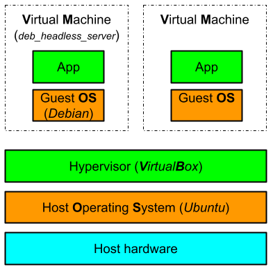

# Project Explained

## What is a Virtual Machine VM

_source:_ [vmware](https://www.vmware.com/uk/topics/glossary/content/virtual-machine.html)

A Virtual Machine (VM) is a compute resource that uses software instead of a physical computer to run programs and deploy apps. One or more "virtual machines" run on a physical “host” machine. Each virtual machine runs its own operating system and functions separately from the other VMs, even when they are all running on the same host.

### Hypervisor

A hypervisor is a piece of software that enables a user to create and run one or more virtual machines simultaneously. A hypervisor is also known as the virtual machine monitor (VMM) and controls the resources of the host machine and allocates to each VM the resources it needs (memory, CPU...), making sure that these VM's do not interfere with each other.

### VirtualBox

It's open-source software which acts as a hypervisor, creating a VM where the user can run another OS.

### advantages:

- VMs can run multiple operating system environments on a single physical computer, saving physical space, time and management costs.
- Virtual machines support legacy applications, reducing the cost of migrating to a new operating system.
- VMs can also provide integrated disaster recovery and application provisioning options

### disadvantages:

- Running multiple virtual machines on one physical machine can result in unstable performance if infrastructure requirements are not met.
- Virtual machines are less efficient and run slower than a full physical computer.

---

## Operating System OS

The OS coordinates the needs of the programs and provides a interface to the hardware.

Rocky

- Rocky is more stable than Debian and supports enterprise applications (for business).
- It comes with many security in-built features that help protect from cyber-attacks using SELinux.

Debian

- Released and supported by the community
- Debian has more software/packages available.
- easier to install
- Debian is one of the oldest Linux distro

## The difference between aptitude and apt?

Aptitude is more powerful in handling complex dependency scenarios, and it provides an interactive interface for package management. For basic package management tasks, either tool can be used interchangeably.

- Aptitude is a high-level package manager while APT is lower level which can be used by other higher level package managers
- Aptitude is smarter and will automatically remove unused packages or suggest installation of dependent packages
- Apt will only do explicitly what it is told to do in the command line

## What is APPArmor?

AppArmor provides **M**andatory **A**ccess **C**ontrol (MAC) security. For example, if an installed application can take photos by accessing the camera application, but the administrator denies this privilege, the application will not be able to access the camera application. If a vulnerability occurs (some of the restricted tasks are performed), AppArmor blocks the application so that the damage does not spread to the rest of the system.

## UFW Uncomplicated Firewall

Developed to ease iptables firewall configuration, ufw provides a user friendly way to create an IPv4 or IPv6 host-based firewall.

## SSH Secure Shell

The Secure Shell Protocol is a cryptographic network protocol for operating network services securely over an unsecured network. Its most notable applications are remote login and command-line execution. SSH applications are based on a client–server architecture, connecting an SSH client instance with an SSH server.

## What is Cron?

Cron or cron job is a command line utility to schedule commands or scripts to happen at specific intervals or a specific time each day. Useful if you want to set your server to restart at a specific time each day.
