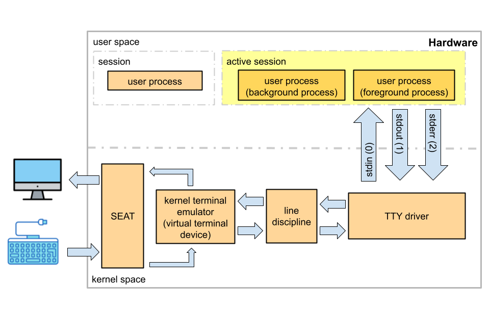

# What do PTY and TTY Mean?

_source:_ [Ahmed Yakout](https://yakout.io/blog/terminal-under-the-hood/), [novaordis.com](https://kb.novaordis.com/index.php/Linux_TTY)

## TTY

<!-- - The words terminal and TTY device are used interchangeably.
- Terminal used to be a physical device that sends characters to the TTY driver.
- The kernel in modern computers emulates the physical terminal device.
- A terminal emulator is as dumb as the physical terminals used to be, it listens for events coming from the keyboard and sends it down to the driver. The difference is that there is no physical device or cable which is connected to the TTY driver. -->

A TTY (**T**ele**ty**pe) terminal session, refers to the interaction between a user and the system through a text-based interface. The term "TTY" is commonly used to describe both physical terminals and virtual terminal emulators.

- A **seat:** consists of all hardware devices (display, keyboard, mouse ..) assigned to a specific workplace.

  | command                      | description                         |
  | :--------------------------- | :---------------------------------- |
  | `loginctl list-seats`        | list all seats                      |
  | `loginctl seat-status seat0` | list devices assigned to seat seat0 |

- **Terminal Devices:** In Unix-like systems, everything is treated as a file, and terminal devices are no exception. TTY devices are represented as special files in the **/dev directory**, such as **/dev/tty1**, **/dev/tty2**, etc.  
  Physical terminals, like the ones used in the early days of computing, were hardware devices connected to a computer. Today, virtual terminals are software-based emulations of physical terminals. They provide text-based interfaces within graphical environments or directly in text-mode consoles.  
   Users can switch between virtual terminals (and your GUI e.g. Ubuntu) using keyboard shortcuts:

  | command               | description                                               |
  | :-------------------- | :-------------------------------------------------------- |
  | `CTRL` + `ALT` + `F3` | switch to virtual terminal tty3 (F4 = tty4, ... up to F6) |
  | `ALT` + `F4`          | when in virtual terminal mode you can switch to tty4      |
  | `ALT` + `F1`          | switch to the login screen                                |
  | `ALT` + `F2`          | switch GUI (e.g. Ubuntu)                                  |

- **line discipline:** The kernel provides many line disciplines but only one is enabled by default and connected to a serial device. The default one, which provides line editing, is called **N_TTY**. This allows for editing (the internal buffer) with commands features like backspace, erase word, and clear line, it also handles special characters such as the interrupt character (CTRL + C). Advanced applications like vim and ssh disables these features by putting the line discipline into raw mode, so they can handle all these stuff themselves. Line discipline is implemented by the TTY driver which is a kernel module.

- **TTY driver:** implements session management which will help user to have many processes running at the same time and only interacting with foreground process which his/her input will be redirected to it and only the foreground process will be allowed to send output to the TTY device.

- **TTY Sessions and Multiplexers:** TTY sessions can be managed using multiplexers like "tmux" or "screen". These tools allow users to create multiple terminal sessions within a single TTY, enabling the management of multiple tasks in a single terminal window.

- **Physical Terminals:** e.g. teletypewriters, hard-copy, video display unit (VDU). In the past, physical terminals were dedicated hardware devices that allowed users to interact with mainframe computers. Modern systems typically use virtual terminals or terminal emulators.

:::tip

Some people use a tty to run commands instead of a terminal emulator in the GUI if they are doing a long running task (e.g system update or moving home directory to another hard disk) and they are afraid the graphical desktop environment (window manager) will crash or freezes causing issues to the task.

:::

## What’s a pseudo terminal PTY? (PTY vs TTY)

Simply It’s Teletype emulated by a computer program running in the "**user space**", in contrast, TTY is a kernel program/emulator.

:::info "kernel-space" vs "user-space"

**Note:** The difference between kernel space and user space is that kernel space has access to the hardware directly while the user space interacts with the kernel only.

:::

PTY will behave like TTY, except that there is no attachment to a seat; you can open several terminal emulator windows at the same time (multiple PTYs) and display them side by side, having different sessions running in parallel.

PTY is pair of master and slave sides, Writing to the master is exactly like typing on a terminal, thus the master pseudo-device acts like the person sitting in front of the physical computer text terminal, whereas the slave pseudo-device emulates a physical computer text terminal, so anything you write in the master will appear in the slave and anything written in the slave will appear to the master.

when you open a terminal emulator program, it forks a process that requests a pty pair from the OS and starts a new session which is a group of processes running under control of a single user (i.e shell), it is defined by the first process that attach the pts (e.g bash).

The slave part (pts) is represented by a file in **/dev/pts/N** where N is a number, you can know what slave your session is attached to using `tty` or `ps` commands.

The master part (ptm), is not represented on the file system. It is represented by a file descriptor obtained by the system call that creates a pty.

### Shells & Sessions

A shell is what allows you to interact with your computer and OS, when I mention the word session , it means shell session which acts as a layer between the kernel and the user, so whenever you run a command in your terminal emulator it’s the shell (e.g bash) that listens for them on the PTY slave attached to it, captures them, communicate with the kernel then write the output back to the PTY slave which the TTY driver will see it and send it to the PTY master so it can be shown in the terminal emulator UI.

The process that is running shell is known as session leader. Every other process that is running in the terminal is child of this session leader. These child processes form process groups that are controlled by this session leader (parent process), and when you logout from the terminal, kernel sends SIGHUP (kill -1) to the session leader, that will propagate this signal to each child process.

Each session is managed by a session leader, the shell, which is cooperating tightly with the kernel using a complex protocol of signals and system calls.

- _Example:_ What happens when you type ls command in terminal?

1. You open the terminal emulator which requests a pty from the OS that will return a pair of file descriptors for the master and slave sides, then starts the bash program as a sub-process and attach it to the slave part.
2. The terminal emulator sends the characters to the master side, the TTY driver takes the character echo them back to the master and buffers them.
3. When you hit enter the TTY driver copies the characters in the buffer to the slave.
4. The bash takes it’s input from the slave (std input steam points to pts) so when you type ls and press enter it will start a child sub-process, executes the command and writes the output to the std output which also points to the pts.
5. The tty driver will take the output from pts and echo it to the master
6. The terminal emulator program will redraw it’s GUI to show you the results of commands you typed.
