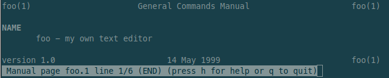
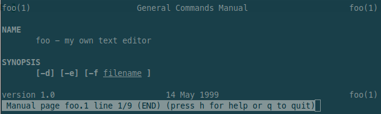
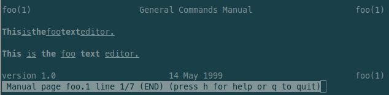
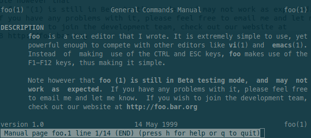
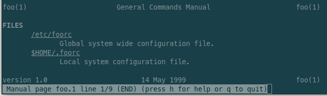
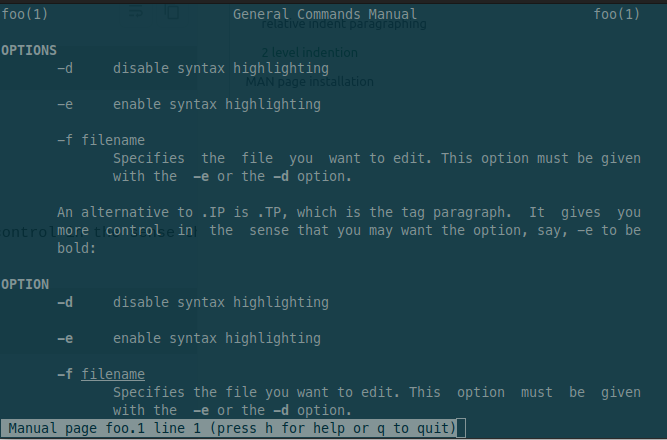

# Create A simple Man Page

_source:_ [cyberciti](https://www.cyberciti.biz/faq/linux-unix-creating-a-manpage/), [linuxhowtos](https://www.linuxhowtos.org/System/creatingman.htm), [pragmaticlinux](https://www.pragmaticlinux.com/2021/01/create-a-man-page-for-your-own-program-or-script-with-pandoc/?utm_content=cmp-true)

## HOW IT WORKS

When you run the command `man foo`, what actually happens is that man runs the `groff` command. Suffice it to say that **groff** is a text formatter that reads special macros in a file and outputs a formatted file, depending upon the macros used. These macros always start with a dot: "`.`" followed by the **macro name**, and its **parameters**.

## TITLE HEADER

We begin with the `.TH` macro. This macro expects at least five parameters in the order of:  
`.TH` **[name of program]** **[section number]** **[center footer]** **[left footer]** **[center header]**

- **[name of program]** This is obviously the name of your program. It will be on the left and right header of each page.
- **[section number]** Manual pages are kept in sections. If you check `/usr/man` you will find up to nine manual directories.

  Section 1: _user commands._  
   Section 2: _system calls._  
   Section 3: _subroutines._  
   Section 4: _devices._  
   Section 5: _file formats._  
   Section 6: _games._  
   Section 7: _miscellaneous._  
   Section 8: _system administration._  
   Section n: _new._

  The section number will appear beside the name of the program in brackets: **foo(1)**

- **[center footer]** You can write anything that you like here and it will be displayed at the center of the footer of every page. Normally you put the date here.
- **[left footer]** You can write anything that you like here and it will be displayed at the left footer of every page. Normally you put the version number of your program here.
- **[center header]** You can write anything that you like here and it will be displayed at the center header of every page. Most manual pages have this omitted.

Here is an example for the title of our program foo:  
`.TH foo 1 "14 May 1999" "version 1.0"`

We have omitted **[center header]**. You can actually omit anything you like, but it is best to have the first four in the manual page. Pay attention to the use of quotations. If you need to have whitespace in a particular section, use quotations to keep the macro from getting confused. This applies to all macros.

## SECTION HEADER / your first page

These sections are defined with the `.SH` macro and you can add as many you like. For instance, the first section is usually **NAME**. `.SH` requires just one parameter:  
`.SH` **[section name]**

- **`.SH`** will always have **[section name]** converted to bold lettering. Text written below `.SH` will be indented. So let us take a look at our current manual page with the `.TH` and the `.SH` macros:

```text title="foo.1 'first page'"
.TH foo 1 "14 May 1999" "version 1.0"
.SH NAME
foo - my own text editor
```

- run the following command to view your page: `man ./foo.1`  
  

## FONT ATTRIBUTES

### bold and italic

The macro for bold is `.B` and the macro for italics is `.I`. Depending on your system, italic fonts may appear as underlined text instead of actually italicized text. Normal font (no bold or italic), is called Roman. Let us further modify our manual page to look like as follows:

```text title="foo.1 'bold and italic'"
.TH foo 1 "14 May 1999" "version 1.0"
.SH NAME
foo - my own text editor
.SH SYNOPSIS
// highlight-start
.B [-d] [-e] [-f
.I filename
.B ]
// highlight-end
```

- run the following command to view your page: `$ man ./foo.1`
  

Each macro only affects the parameters that are passed to it. That is why in order to italicize **filename**, it has to be put on a new line with the `.I` macro prefixing it. This is how we mix bold and italics. Then to have the closing brace in bold, it has to be put on its own line prefixed with `.B`.

### alternating formats

It is possible to have bold and italics alternating on each parameter (bold italic bold italic...).  
The macro for it would be `.BI`:

`.BI This is the foo text editor.`

There does not appear to be any white space. In order to have white space and to control what belongs to bold/italic, we to use quotations.  
NOTE: the quotations have whitespace trapped inside. All the font macros can be mixed in this way.

`.BI "This " "is " "the " "foo " "text " "editor."`



| macro | description              |
| :---- | :----------------------- |
| `.B`  | bold                     |
| `.BI` | bold alternating italic  |
| `.BR` | bold alternating Roman   |
| `.I`  | italic                   |
| `.IB` | italic alternating bold  |
| `.IR` | italic alternating Roman |
| `.RB` | Roman alternating bold   |
| `.RI` | Roman alternating italic |

## COMMENTING

You can comment the source code for the manual page. Comments are prefixed with `."`, as in:  
`." This is a comment`

## PARAGRAPHING

### line break

- A **line break** is created with a blank line.

### automatically indentation

- Text which starts without the `.SH` macro, is **automatically indented**.

```text title="foo.1 'paragraphing (line break)'"
.TH foo 1 "14 May 1999" "version 1.0"
.SH DESCRIPTION
.B foo
is a text editor that I wrote. It is extremely simple to use,
yet powerful enough to compete with other editors like
.BR vi "(1) and " emacs "(1). Instead of making use of the CTRL and ESC keys, "
.BR foo " makes use of the F1-F12 keys, thus making it simple."
." line break, empty line
// highlight-start

// highlight-end
Note however that
.B foo "(1) is still in Beta testing mode, and may not work as expected. "
If you have any problems with it, please feel free to email me and let me know.
If you wish to join the development team, check out our website at
.B http://foo.bar.org
```

- run the following command to view your page: `man ./foo.1`  
  

### relative indention

To indents all following paragraphs by 0.5 inches to the right. You need to mark the start `.RS` and the end `.RE` of the indentation.

```text title="foo.1 'relative indent'"
.TH foo 1 "14 May 1999" "version 1.0"
.SH FILES
.I /etc/foorc
// highlight-start
.RS
Global system wide configuration file.
.RE
// highlight-end
.I $HOME/.foorc
// highlight-start
.RS
Local system configuration file.
.RE
// highlight-end
```

- run the following command to view your page: `man ./foo.1`  
  

### 2 level indention

- Everything after `.IP` apers at the **1st level of indention**, everything what comes on a new line is placed at the **2nd level of indentation**.
- `TP` works similar, but it also allows you to format. The 1st line after `.TP` appears on the **1st level**, everything what comes after on a new line is placed on the **2nd level of indentation**.

```text title="foo.1 '2 level indention'"
.TH foo 1 "14 May 1999" "version 1.0"
.SH OPTIONS
// highlight-start
.IP -d
disable syntax highlighting
// highlight-end
.IP -e
enable syntax highlighting
.IP "-f filename"
Specifies the file you want to edit. This option must be given with the
.BR " -e " "or the " "-d " option.

.IP "An alternative to .IP is .TP, which is the tag paragraph. It gives you more control in the sense that you may want the option, say, -e to be bold:"

.SH OPTION
// highlight-start
.TP
.B -d
disable syntax highlighting
// highlight-end
.TP
.B -e
enable syntax highlighting
.TP
.BI -f " filename"
Specifies the file you want to edit. This option must be given with the
.BR " -e " "or the " "-d " option.
```

- run the following command to view your page: `man ./foo.1`  
  

## MAN page installation

To be able to call your man page from any where we need to install it correctly.

1. Compress the MAN page with Gzip:  
   `gzip foo.1`  
   NOTE: use `gzip -d foo.1.gz` to ungzip a file.
2. Copy the MAN page for our script to the directory where all MAN pages for programs and scripts reside:  
   `sudo cp foo.1.gz /usr/share/man/man1/`  
   NOTE: the folder man1 is for the MAN pages 1.
3. Update MAN’s internal database:  
   `mandb`
4. Now you should be able to view your man page from any where:
   `man foo`
