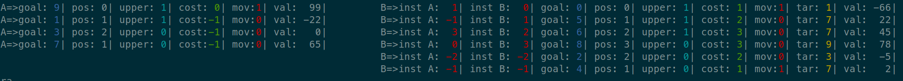

# The Concept

The idea is to move all numbers but 3 to the "b stack" (`co_push_a_to_b()`).  
  
Sort the remaining 3 numbers in the "a stack" (`sort_3_node_a()`).  
  
After bring back the numbers from the "b stack" in the correct place.  
If there is no bigger number in the "a stack", then the number is added as first number,  
which makes it the last after rotating the "a stack" (`move_cheapest_node()`)  
  
After all numbers have been pushed back to the "a stack", we only need to rotate till the lowest number is at the top (`sort_start()`).

## Meta Data

On the screen shot below you can see a printf of the meta data which I assigned to each number (_node_). I used a lot of this information during development to test the actual values and to fine tune the algorithm.  
  
After moving a number to the "a stack" all the data needs to be updated again, except some data which is not needed for the "a stack" but still left there.

