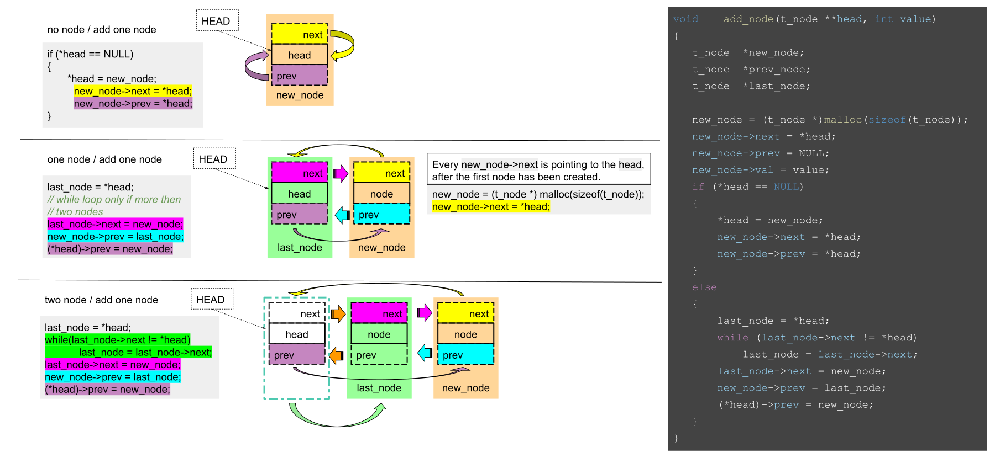

# Doubly Circular Linked List

## What is it

A circular doubly linked list is a data structure that consists of a collection of nodes, where each node contains a data element and two pointers: one that points to the next node in the list and another that points to the previous node in the list, that makes it **doubly**.  
The list does not end with a `NULL` pointer but it points back to the head which makes it **circular**.

## How to create it

(_Tip: you can right click and select "Open image in a new tab" to see it better_)


## How to iterate trough it

Because the only reference we have in the list is its pointer to the head, this makes it difficult to traverse through it. I came up with the following code to easily loop through it:

```c showLineNumbers
	bool	start;                      // "on-off switch" to pass first iteration
	t_node	*current;                   // same data type as head of list

	start = true;                       // first node
	current = *head;                    // pass the address of the head of the list
    	// highlight-next-line
	while (current != *head || start)   // as long one condition is true
	{
		start = false;                  // loop will break when current is pointing to head again
    /* do something (current ...)*/
		current = current->next;        // move to the next node
	}
```

- **line 6:** only on of the two conditions need to be **true**:
  - _on the first iteration:_ `current != *head` is **false** but `start` is **true**
  - _after:_ `current != *head` becomes **true** and `start` stays **false** for the rest of the loop
  - _end:_ when `current` points to `head` again then both conditions are **false** and the loop breaks
- **line 9:** at this point each node is available when its turn has come in the loop
