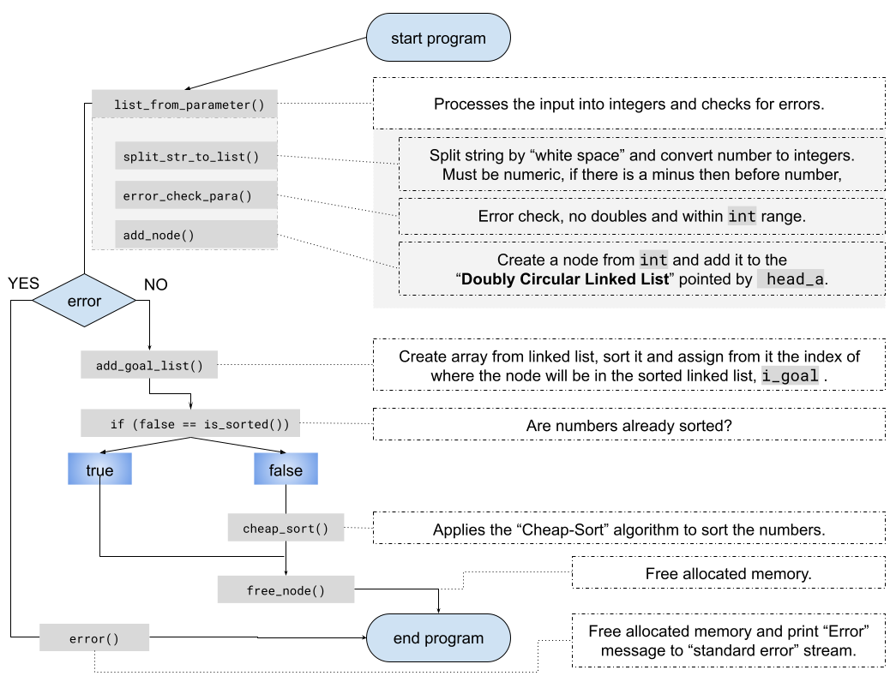
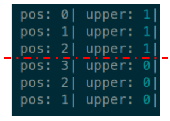
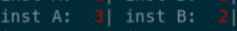

# Implementation

code link: [push_swap gitHub repository](https://github.com/Zolske/42_projects/tree/main/03_cursus/push_swap)

To understand the code better, you should have a look on the next chapter "Doubly Circular Linked List".

## Overview

Each number is added as node to a linked list, there can be two linked list to which `head_a` and `head_b` are pointing (_representing the two stacks_). This nodes also store "meta data" which is used to decide which and how to move (_sort_) the numbers (_nodes_).

### program entry (main) - push_swap.c

Is the entry point of the program, from here all other functions are called.

```c showLineNumbers
int	main(int argc, char **argv)
{
	t_node	*head_a;								// pointer for linked list

	head_a = NULL;
	if (1 == argc || (2 == argc && !argv[1][0]))	// end if no args or empty
		return (1);
	else
		list_from_parameter(argc, argv, &head_a);	// convert to int, error check
	add_goal_list(&head_a);							// make finale index, goal
	if (false == is_sorted(head_a))					// check if list is sorted
		cheap_sort(&head_a);						// sort num, print instructions
	free_node(&head_a);								// free allocated memory
	return (0);
}
```

<details>
	<summary>code explanation (<i>including links to gitHub repo</i>)</summary>
	<ul>
		<li><b>line 3-5:</b> I declare and initialize a pointer of type <code>t_node</code> with the identifier <code>head_a</code>,<br></br>
		it will point later to a "<b>Doubly Circular Linked List</b>" representing the "<b>stack A</b>" <br></br>
		(<i>see <a href="https://github.com/Zolske/42_projects/blob/main/03_cursus/push_swap/push_swap.h" target="_blank"><code>push_swap.h</code></a> for structure explanation</i>).<br></br>
		This allows me to easily rotate the stuck by changing to which node the "head" is pointing to and to add "meta data" to each node (<i>number</i>).
		</li>
		<li><b>line 6-7:</b> If there are no arguments then end the program.
		<ul>
			<li><code>1 == argc</code> counts only the name of the program,</li>
			<li><code>2 == argc</code> one argument but <code>!argv[1][0]</code> string is empty</li>
		</ul>
		</li>
		<li><b>line 9:</b> <a href="https://github.com/Zolske/42_projects/blob/main/03_cursus/push_swap/push_swap.c" target="_blank"><code>list_from_parameter()</code></a> Convert the arguments to integers and creates a linked list to which the pointer <code>head_a</code> is pointing to. While doing that, I also perform error checking (<i>no doubles, must be int, only numeric input</i>).</li>
		<li><b>line 10:</b> <a href="https://github.com/Zolske/42_projects/blob/main/03_cursus/push_swap/push_swap.c" target="_blank"><code>add_goal_list()</code></a> create an array from the input values, sorts it ascending and marks the nodes in <code>head_a</code> with the index of there final position (<i>the goal of the sorting</i>).</li>
		<li><b>line 11:</b> <a href="https://github.com/Zolske/42_projects/blob/main/03_cursus/push_swap/sort.c" target="_blank"><code>is_sorted()</code></a>if list is not sorted, then allow the next function which will sort it to be called</li>
		<li><b>line 12:</b> <a href="https://github.com/Zolske/42_projects/blob/main/03_cursus/push_swap/push_swap.c" target="_blank"><code>cheap_sort()</code></a> contains the algorithm to sort the numbers and print the instructions.</li>
	</ul>
</details>

The diagram shows a how the program is structured.


---

## Cheap-Sort Algorithm

code link [cheap_sort()](https://github.com/Zolske/42_projects/blob/main/03_cursus/push_swap/push_swap.c)

Is the actual algorythemen to sort the numbers (_nodes_).

### Overview

If there are more then 3 numbers, then I need to apply the full sorting algorithm (_line 11_).

```c showLineNumbers
void	cheap_sort(t_node **head_a)
{
	int		len;
	t_node	*head_b;

	len = get_len(*head_a);				// length of linked list
	if (1 == len)						// one number does not need sorting
		return ;
	else if (3 >= len)					// 3 => num, don't need to be pushed to B
		sort_3_node_a(head_a);
	else
	// highlight-next-line
		sort_more_node(head_a, len);	// 3 < num, contains the full sorting algo
}
```

### More then 3 Numbers - [sort_more_node()](https://github.com/Zolske/42_projects/blob/main/03_cursus/push_swap/sort.c)

```c showLineNumbers
void	sort_more_node(t_node **head_a, int len)
{
	t_node	*head_b;							// pointer to the top of stack B

	head_b = NULL;
	while (len-- > 3)							// as long the len is bigger then 3
		co_push_a_to_b(head_a, &head_b);		// move node to B, which is the top form A
	sort_3_node_a(head_a);
	while (head_b != NULL)						// loop till there is no more node in B
	{
		update_all(head_a, &head_b);			// before moving update meta data
		move_cheapest_node(head_a, &head_b);	// move nodes
	}
	sort_start(head_a);							// is sorted but rotate the stack, low. top
	free_node(&head_b);
}
```

Sofar all numbers have been linked together and pointed at by the `head_a` pointer which marks the top of the stack. Now I removing all but 3 numbers (<i>nodes</i>) from this link and link them separably together to which the new pointer `head_b` is pointing to. This represents the "stack B" where the first number on top is the node `head_b` is pointing at.  
Every time I want to move a node back I need to update the meta data regarding of where in the stack the number is and how much it cost to move it together with the instructions for moving.

---

### Meta Data - [update_all()](https://github.com/Zolske/42_projects/blob/main/03_cursus/push_swap/update.c)

```c
void	update_all(t_node **head_a, t_node **head_b)
{
	if (*head_b != NULL)				// not needed, already checked outside
	{
		update_idx(head_a);				// index in its stack
		update_idx(head_b);
		update_pos(head_b);				// position (how fare to the top by rotating the stack)
		update_pos(head_a);
		update_target(head_b, head_a);	// add the pair (target) in stack B to each num
		update_cost_instruc(head_b);	// calculate cost and set instructions for moving
		update_move(head_b);			// mark which numbers are the lowest for moving
	}
}
```

#### [`update_target()`](https://github.com/Zolske/42_projects/blob/main/03_cursus/push_swap/update_target.c)

Iterates the linked list (_"stack B"_) and either adds the "next bigger number" (`next_bigger_goal()`) from "stack A" as pointer to `tar` or if there is no bigger number then the "smallest" (`smallest_goal()`) (_basically it adds itself to the and after rotating the stack_).

#### [`update_cost_instruc()`](https://github.com/Zolske/42_projects/blob/main/03_cursus/push_swap/update_cost_instruc.c)

- the functions `both_up()`, `both_down()`, `up_a_down_b()`, `down_a_up_b()` calculates the total cost of moving the node and its target to the top of the stack and returns the value as `int` which is saved in `shortest`. This value is saved from the first function on "line 16" and then compared to the return of the functions after. We are looking for the shortest value, if there is a shorter value then we overwrite it so that we end with the shortest value once we arrive at the end.  
  On "line 23" we then save it under `cost`.
- there is a second purpose, we also want to set the instructions of how to move it to the top, which can be by "rotating" the stack (_moving the number up, gets a positive value_) or "reverse rotating" the stack (_moving the number down, gets a negative value_). The value determines how many times we need to rotate so that eventually the "head" is pointing to the node (_number_) which we want to move. NOTE, that the negative value is just to differentiate later in which direction to move.  
  This value is set within the functions, the last argument determent if we want to set this information in the node. `true` means that we want to write if and `false` not to. This is done because in the "if statement" the function is already called so that we would keep overwriting the instructions of how to move the node and its target. But we only want to write that if it returns the "shortest value", we then call the function again with true.

```c showLineNumbers
void	update_cost_instruc(t_node **head_b)
{
	int		shortest;
	int		len_a;
	int		len_b;
	bool	start;
	t_node	*current;

	start = true;
	current = *head_b;
	len_a = get_len((*head_b)->tar);
	len_b = get_len(*head_b);
	while (current != *head_b || start)
	{
		start = false;
		shortest = both_up(&current, len_a, len_b, true);
		if (shortest > both_down(&current, len_a, len_b, false))
			shortest = both_down(&current, len_a, len_b, true);
		if (shortest > up_a_down_b(&current, len_a, len_b, false))
			shortest = up_a_down_b(&current, len_a, len_b, true);
		if (shortest > down_a_up_b(&current, len_a, len_b, false))
			shortest = down_a_up_b(&current, len_a, len_b, true);
		current->cost = shortest;
		current = current->next;
	}
}
```

- The functions check how much it would cost to move the nodes (_target, number_) in different directions:  
  (_the target is always in "stack A" and the number in "stack B"_)

  - [`both_up()`](https://github.com/Zolske/42_projects/blob/main/03_cursus/push_swap/update_cost_instruc.c) target **up**, number **up**
  - [`both_down()`](https://github.com/Zolske/42_projects/blob/main/03_cursus/push_swap/update_cost_instruc.c) target **down**, number **down**
  - [`up_a_down_b()`](https://github.com/Zolske/42_projects/blob/main/03_cursus/push_swap/update_cost_instruc.c) target **up**, number **down**
  - [`down_a_up_b()`](https://github.com/Zolske/42_projects/blob/main/03_cursus/push_swap/update_cost_instruc.c) target **down**, number **up**

- To calculate the the cost we need to know if the number is in the **upper** half or not.
  - within the function we simply check: `->tar->upper` == `true` is upper and it's position `->pos`
    
- within this functions are another set of functions which write the instructions of how to move the node, here is an example:
  - [`mv_instr_upper_a()`](https://github.com/Zolske/42_projects/blob/main/03_cursus/push_swap/help_cost_instruc.c) returns how many instructions to move "**A**" if it is in the "upper half".

```c
int	mv_instr_upper_a(t_node **head_cur, int len, bool move_up, bool write)
{
	if (move_up)
	{
		if (write)
			(*head_cur)->instr_a = (*head_cur)->tar->pos;
		return ((*head_cur)->tar->pos);
	}
	else
	{
		if ((*head_cur)->tar->pos == 0)
		{
			if (write)
				(*head_cur)->instr_a = 0;
			return (0);
		}
		else
		{
			if (write)
				(*head_cur)->instr_a = (len - (*head_cur)->tar->pos) * -1;
			return (len - (*head_cur)->tar->pos);
		}
	}
}
```

- `bool move_up` determents if we are moving up or down
- `bool write` if we want to write the instruction into the node
- `((*head_cur)->tar->pos == 0)` number is already on top, do not move
- `(len - (*head_cur)->tar->pos) * -1;` calculate to move and turn the value negative, to differentiate that we are going to move down

---

### Move Node - [`move_cheapest_node()`](https://github.com/Zolske/42_projects/blob/main/03_cursus/push_swap/move.c)

Contains the functions for moving the nodes. Because, when we rotate the stack we are updating the head which is the pointer to the "node on top", we do not really need to know which node needs to be moved only how many times we need to rotating the stack.

The function `move_b_and_a_top()` contains the function `find_node_move()` which returns a pointer to the node which is the cheapest from the top of "stack B".  
This node then contains under `->instr_a` how many times the "stack A" needs to be rotated for the target to be on top and under `->instr_b` how many moves to rotate to bring itself to the top of "stack B". Negative numbers mean that we need to "revers rotate" the stack to get quicker to the top.

```c showLineNumbers
void	move_cheapest_node(t_node **head_a, t_node **head_b)
{
	t_node	*move_node;								// pointer to the node which will be moved

	move_node = move_b_and_a_top(head_a, head_b);	// move both nodes at the same time
	move_b_top(head_b, &move_node);					// move only B if needed
	move_a_top(head_a, &move_node);					// move only A if needed
	co_push_b_to_a(head_b, head_a);					// push the top of B to A
}
```

- **line 5:** tries to move both nodes to the top as long both instructions are positive or negative, for example:  
    
  _both nodes can be move up at the same time with two instructions, after the node in "stack A" is only on move away from the top_
- **line 6:** if node **B** needs moving then it is moved to the top
- **line 7:** if node **A** needs moving then it is moved to the top
- **line 8:** pushes the top node form **B** to **A**

### `co_` functions

Functions which start with `co_` are functions which change to where the "head" is pointing or moving a node from one "list" to the other. They also "print" the there "push swap instruction" to the "standard output".
