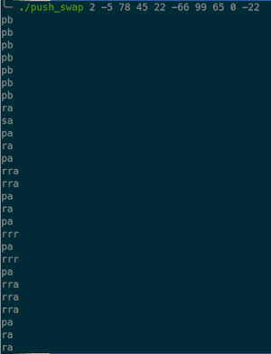
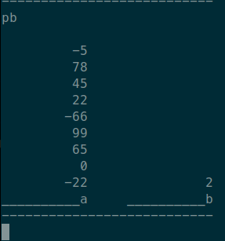

# Subject Overview

Write a program in C called **push_swap** which uses the "**push swap instructions**" to sort integers passed as arguments. The program can use two stacks to accomplish this task but all numbers need be sorted in ascending order in the first stack (a) after the program has finished. You do not need to return the sorted numbers but print to the standard output the instructions which where used for sorting.

## Push Swap instructions

- you have 2 stacks named **A** and **B**
- the numbers which are given as input are stacked (_first input at the bottom_) in stack **A** while **B** is empty
- the input can be a single argument as a string containing the values separated by spaces (_"4 -1"_) or  
  as single numeric arguments (_4 -1_)
- return `Error` followed by a new line if:
  - there is a **non numeric** input (_except a prefixed minus_),
  - a duplicated number,
  - the input values are outside of the `int` data type range
- print nothing if the numbers are already sorted or if there is only one
    

    
list of <b>push swap instructions</b> which can be used:

   The instruction (function) which is used to change the stack need to be printed to the standard output followed by a new line.

  | command to be printed | function used in my code | description                                                                                                  |
  | :-------------------- | :----------------------- | :----------------------------------------------------------------------------------------------------------- |
  | `sa`                  | `co_swap_a()`            | (_swap a_): Swap the first 2 elements at the top of stack a. Do nothing if there is only one or no elements. |
  | `sb`                  | `co_swap_b()`            | (_swap b_): Swap the first 2 elements at the top of stack b.Do nothing if there is only one or no elements.  |
  | `ss`                  | `co_swap_both()`         | sa and sb at the same time.                                                                                  |
  | `pa`                  | `co_push_b_to_a()`       | (_push a_): Take the first element at the top of b and put it at the top of a. Do nothing if b is empty.     |
  | `pb`                  | `co_push_a_to_b()`       | (_push b_): Take the first element at the top of a and put it at the top of b. Do nothing if a is empty.     |
  | `ra`                  | `co_rotate_a()`          | (_rotate a_): Shift up all elements of stack a by 1. The first element becomes the last one.                 |
  | `rb`                  | `co_rotate_b()`          | (_rotate b_): Shift up all elements of stack b by 1. The first element becomes the last one.                 |
  | `rr`                  | `co_rotate_both()`       | ra and rb at the same time.                                                                                  |
  | `rra`                 | `co_rev_rotate_a()`      | (_reverse rotate a_): Shift down all elements of stack a by 1. The last element becomes the first one.       |
  | `rrb`                 | `co_rev_rotate_b()`      | (_reverse rotate b_): Shift down all elements of stack b by 1. The last element becomes the first one.       |
  | `rrr`                 | `co_rev_rotate_both()`   | rra and rrb at the same time.                                                                                |

  

## How the push swap program works

The program takes a list of integers and returns the "push swap commands" which are necessary to sort the numbers in ascending order.

To illustrate how the numbers are sorted I used [the debugger tool from "yfu, 42LYON"](https://github.com/LeoFu9487/push_swap_tester?tab=readme-ov-file#debug) and recorded it.

##
