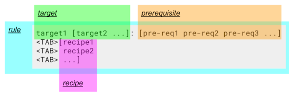

# Makefile Basics

_Explains and demonstrates the basic functionality on an shell script example._

_source: ["Makefile Tutorials and Examples to Build From"](https://earthly.dev/blog/make-tutorial/) by "Aniket Bhattacharyea" updated 02.09.2021_

---

## How does it work?

The "make" program requires a file, `Makefile` (or `makefile`), which defines a set of tasks to be executed. It comes with most of the Linux distributions. "Make" compares the modification date of the "source" (_prerequisite_) to the target file, if the date of the "source" is **NOT** newer than the one of the "target", then there has not been an update and therefore there is no need to execute the instructions in the "Makefile".
You can name your "Makefile" anything, but then you have to explicitly tell make which file to read:

```bash
make -f some_other_makefile
```

## basic syntax of an makefile

  
_note: `[]` indicates optional, `...` indicates multiple, `<TAB>` indicates one tab_

- **target:**

  - _one is mandatory, multiple targets are separated through empty spaces_
  - the "target" is what should be produced
  - _"targets" without a prerequisite are considered to be older than their dependencies, and so they’re always run_
  - _It is not necessary for the target to be a file; it could be just_ a name for the recipe _. We call those_ "phony targets" _._

- **prerequisite:**

  - _optional, multiple prerequisites are separated through empty spaces_
  - the "prerequisite" is what is needed to create or update the "target"
  - _the prerequisites can be the name of an existing rule, or the name of a file in the same directory_

- **recipe:**

  - _optional, multiple recipes are separated through a new lines_
  - the "recipe" is how to produce the "target"
  - _are shell commands that need to be run in order to generate the target_
  - _executes if the "modification date" of the "prerequisite file" is newer than the one of the "target file". If one of them is not a file then there is no modification date and the commands are always executed_
  - _recipes need to be indented with one "tab" not "spaces"_
  - `@` *in front of the command (*no space*) prevents the command to be displayed in the "Terminal" when `make` is run*

- **rule:**
  - _only the first rule is executed with the `make` command_
  - `all`: _if the first rule has the target "all", then all rules are executed, or just the ones which are listed as "prerequisite"_

### Example: counting words/ characters in a file

1. run the following command to create the text file "data.txt" with "Hello World":

```bash
echo "Hello World" > data.txt
```

2. create a "Makefile" in the same directory, with the following content:

```makefile title="Makefile"
all: count.txt                  # run only the rule "count.txt"

count.txt: data.txt              # if "data.txt" is newer than "count.txt"
    wc -c data.txt > count.txt   # Count characters
    @wc -w data.txt >> count.txt # Count words, command not shown in CLI
    wc -l data.txt >> count.txt  # Count lines
```

3. run the `make` command in that directory
   - the shell output should be:

```cli
wc -c data.txt > count.txt   # Count characters
wc -l data.txt >> count.txt  # Count lines
```

- a file with the name of "count.txt" should have been created
- the content of the file should be:

```txt title="count.txt"
12 data.txt
2 data.txt
1 data.txt
```

4. run the `make` command a second time:
   - there should be no execution of the shell commands (_recipes_) because the prerequisite is **NOT** newer than the target
   - the shell output should be:

```cli
make: Nothing to be done for 'all'.
```

## cleaning up the project files

It is a recommended practice to have a clean rule to delete any generated files, effectively returning the project to the initial state. Add the following rule to the end of your Makefile:

```makefile title="Makefile"
clean:
    rm count.txt  # remove count.txt
```

- The clean rule doesn’t have a prerequisite, so it always runs with the command `make clean`

## Components of Makefile

### Comments

- _start with `#` and stretch till the end of the line_

---

### Variables

`Make` supports using variables to avoid repetitions and keep the Makefile clean. Another advantage of variables is that the user can override them without needing to edit the Makefile manually.  
When make is run, it also converts all available environment variables into make variables. So you can freely use any environment variable.

#### Defining Variables

```makefile title="Syntax"
IDENTIFIER = VALUE
```

- note: _values can also be assigned with `:=` or `::=` instead of `=` which is different, [see GNU make manual](https://www.gnu.org/software/make/manual/make.html#Flavors)_

#### Referencing Variables

```makefile title="Syntax"
$(IDENTIFIER)  # with ()
${IDENTIFIER}  # with {}
```

### Changing Values When Calling Make

The value of variables can be changed temporary when calling the "make" command.

```makefile title="Syntax"
make IDENTIFIER=NEW_VALUE
```

### Example: using variables

_replacing the hard coded values with variables is cleaner and more flexible_

```makefile
TARGET = count.txt
SOURCE = data.txt

all: $(TARGET)

$(TARGET): $(SOURCE)
    wc -c $(SOURCE) >  $(TARGET) # Count characters
    @wc -w $(SOURCE) >> $(TARGET) # Count words, @ no show command output
    wc -l $(SOURCE) >> $(TARGET) # Count lines

clean:
   rm $(TARGET)
```

- Note:
  - line 4:
    - _only the first rule is executed with the `make` command_
    - _because the "target" is `all` every rule which is listed after is executed with `make` (in this case only count.txt)_
    - _"TARGET" / "count.txt" is the name of a the rule in "line 6" but it in this case it is also a reference to the file_
  - line 6:
    - *if the modification date on the file of "SOURCE" / "data.txt" is newer than the one on "TARGET" / "count.txt" than the recipe (*shell commands*) are executed*
  - line 11:
    - _the "clean" rule is only executed with `make clean` **NOT** with `make` alone_

_changing the variable value of "TARGET" (count.txt to newcount.txt) when calling the "make" command_

```makefile
make TARGET=newcount.txt
```

_changing the variable value of "TARGET" and calling only the "clean rule"_

```makefile
make TARGET=newcount.txt clean
```

---

### Automatic Variables

Their values are computed each time for every rule and are based on the target and prerequisite file names.

| variable | explanation                                                                                                                                                    |
| -------- | -------------------------------------------------------------------------------------------------------------------------------------------------------------- |
| `$@`     | This is the target file name. If there is more than one target, this is whichever target caused the recipe to run.                                             |
| `$*`     | This is the target file name without the extension.                                                                                                            |
| `$<`     | This is the name of the first prerequisite.                                                                                                                    |
| `$?`     | The names of all the prerequisites that are newer than the target, with spaces between them. If the target does not exist, all prerequisites will be included. |
| `$^`     | The names of all the prerequisites, with spaces between them and duplicates removed.                                                                           |
| `$+`     | Same as `$^`, except it includes duplicates.                                                                                                                   |

_There are other automatic variables. For a full list, [see GNU make manual](https://www.gnu.org/software/make/manual/make.html#Automatic-Variables)._

#### Example: Automatic Variables

```makefile
TARGET = count.txt
SOURCE = data.txt

all: $(TARGET)

$(TARGET): $(SOURCE)
   wc -c $< >  $@ # $< matches the source file name, $@ matches the target file name
   wc -w $< >> $@
   wc -l $< >> $@

clean:
   rm $(TARGET)
```

---

### Virtual Paths

Often you have files organised into directories. It is not always possible to write the entire file name every time. You can use `VPATH` (**uppercase**) to specify where make should search for targets and prerequisites.

_example:_

```makefile
VPATH = directory1 directory2  # directories "directory1" and "directory2"

file1: file2       # rule
```

- To find `file1` "make" will search in the "current directory" and than in "directory1" and "directory2" which are specified under `VPATH`.  
  Thus if you have `directory1/file1`, instead of writing the whole path every time, you can use `VPATH` to tell make where to search for it.
- To limit the search time, you can tell "make" in which directory to look specifically, for that, `vpath` (**lowercase**) is used.

```makefile
vpath file1 directory1
vpath file2 directory2
vpath %.txt directory_text
```

- The `%` is like `*` of "regex". It matches anything. This tells "make" to search for files ending in `.txt` in the directory `directory_text`.

---

### Phony Target

In our "example", there are two “special” targets, `all` and `clean`. Since they do not have any "prerequisite", and there are no files named `all` or `clean` in the project, they are always considered to be older than their dependencies and always executed.

But if you create a file called "all" or "clean" in the directory, "make" will get confused. Since the "all" or "clean" file is there, and the targets have no "prerequisites", they will be considered newer than their "prerequisites". Therefore, the "recipes" will never be run. To fix this, you can declare the `targets` to be “phony”:

```makefile
.PHONY: all clean

...                 # rest of the code
```
