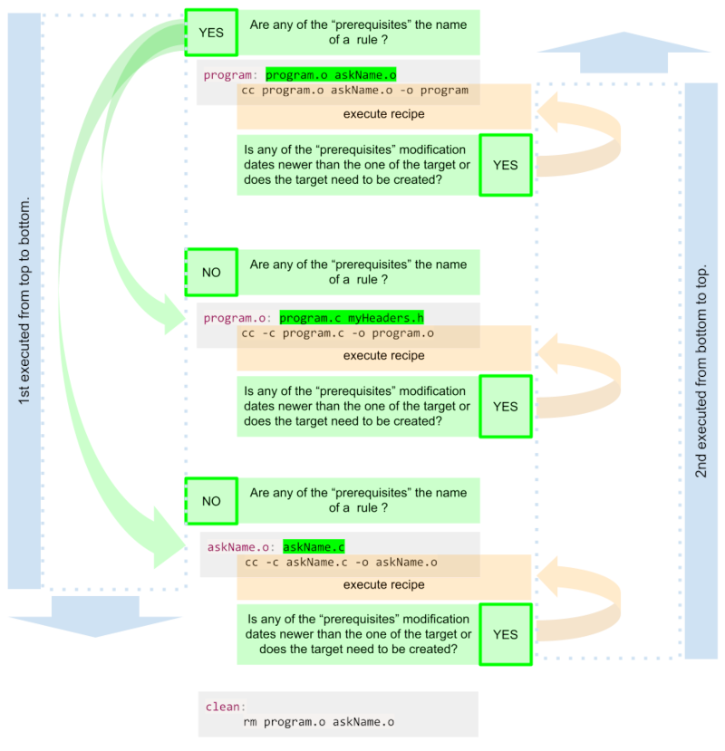

# Compile C Objects to Executable

The example shows a simple C program which ask the user to enter his name and than to return it to the screen.
To compile the source files into a executable, each of the source (.c) files need to be compiled into object (.o) files which can after be linked together to an executable file.

---

## File Setup

- there are 3 files:
  - program.c _contains the main function_
  - askName.c _contains the function which waits for the user to enter a string and than returns it_
  - myHeaders.h _contains the functions "prototypes" which have to be included into the "main function"_

### program.c

```c title="program.c" showLineNumbers {2,9}
#include<stdio.h>       // for printf()
#include"myHeaders.h"   // prototype for askName(),  "" instead of <>

int main(void)
{
        char name[20];

        printf("Please, enter your name:\n");
        printf("Your name is, %s.\n", askName(name));
        return (0);
}
```

- line 2: _include header `myHeaders.h`, **Note:** needs to be set in `""` and **NOT** in `<>`_
- line 9: _uses the return of the `askName()` function to get a string input from the user, the function is defined in "askName.c" file_

### askName.c

```c title="askName.c" showLineNumbers {5}
#include<stdio.h>       // for scanf()

char* askName(char* name)
{
        scanf("%s", name);
        return (name);
}
```

- line 5: _waits for user to enter a string_

### myHeaders.h

```c title="myHeaders.h"
char* askName(char*);
```

- _contains the "prototype" of the function from the separated file to be included into the "main" function_

---

## Compiling without a Makefile

```bash showLineNumbers
cc -c askName.c -o askName.o
cc -c program.c -o program.o
cc askName.o program.o -o program
```

- `-c` create object file from source ".c" file, `-o` name output file ...
- line 1-2: _create from the source (.c) file the object (.o) file and name it "askName.o", "program.o"_
- line 3: _"link" the object files together and name the executable "program"_

---

## Compiling with a Makefile

- create a file named `Makefile` or `makefile` with the following content:

```makefile title="Makefile"
program: program.o askName.o
        cc program.o askName.o -o program   # remember to use 1 tab

program.o: program.c myHeaders.h
        cc -c program.c -o program.o       # remember to use 1 tab

askName.o: askName.c
        cc -c askName.c -o askName.o       # remember to use 1 tab

clean:
        rm program.o askName.o             # remember to use 1 tab
```



- _Only the "first rule" is executed with the `make` command and any other "rule" who's "target" match the "prerequisite" of an previous "rule"._
- _The "clean rule" is not executed with the `make` command because it is not connected to the "first rule", but it can be called with `make clean`._
- _If there has been no changes, than the `make` command will not execute after the first time, because the result would be the same._
- _Any change in the "linked" files would change also the modification date and therefore execute the "makefile" after the `make` command._
- _The "myHeaders.h" file is not used in the "recipe" but if changed it would execute the "makefile" after the `make` command._
